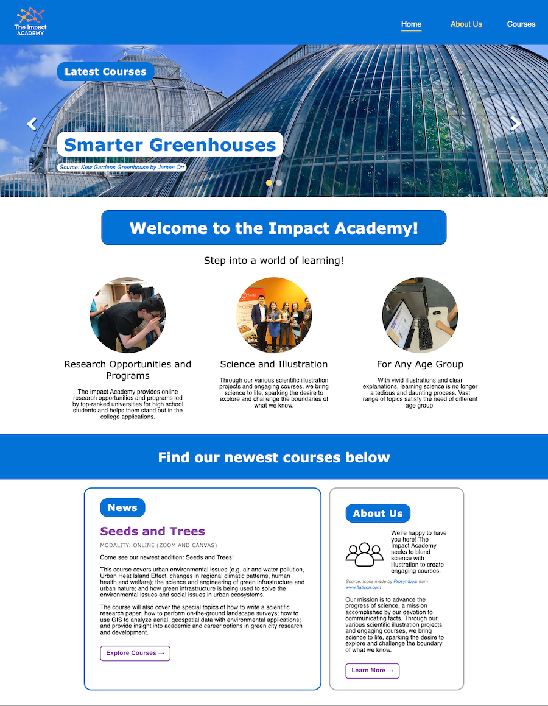
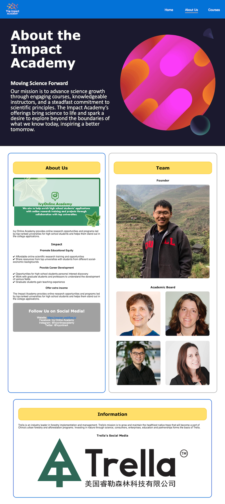
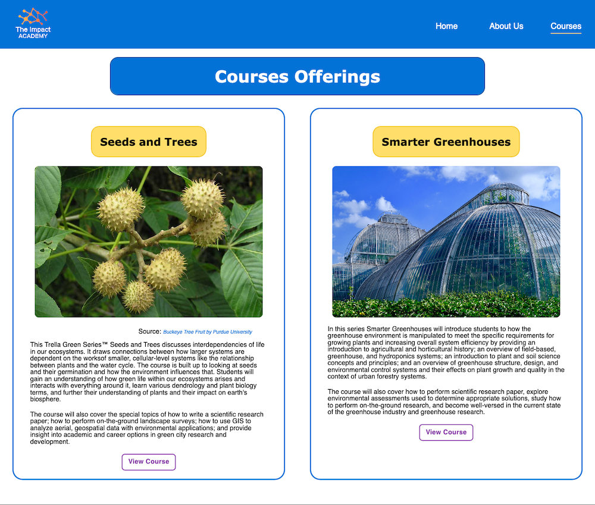
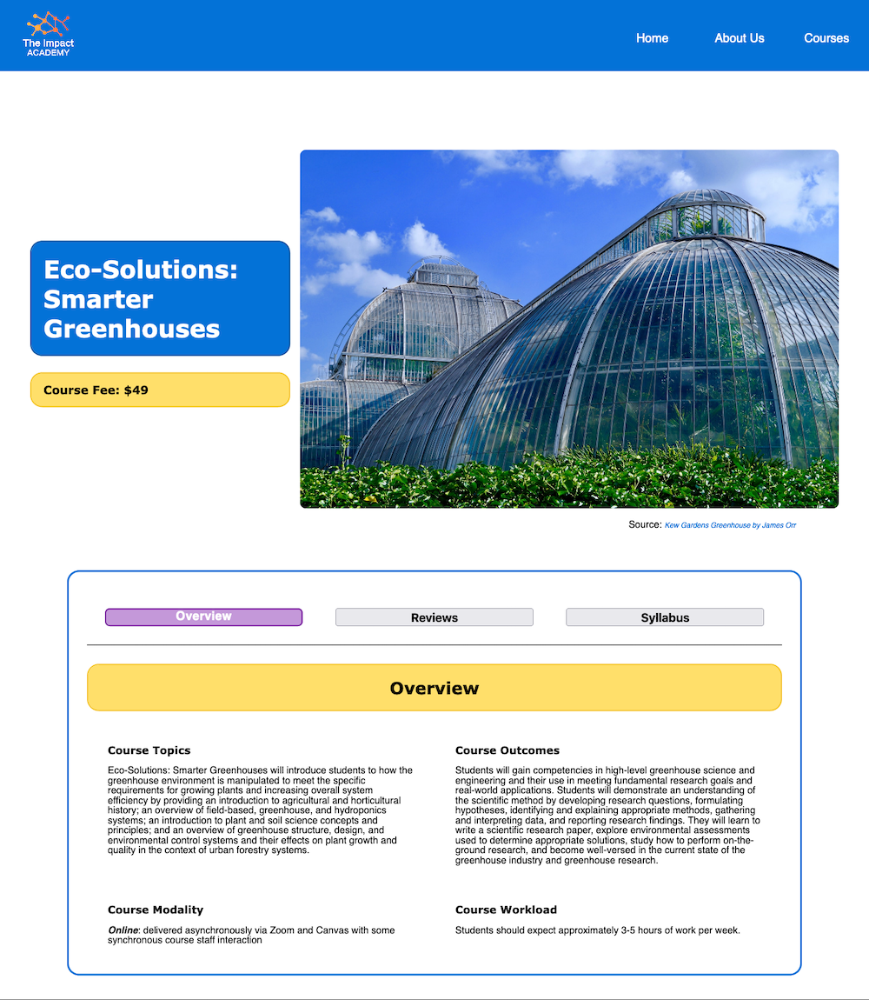
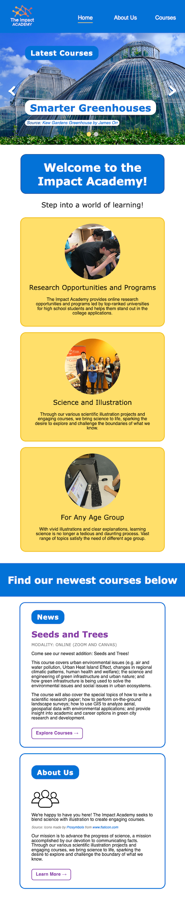
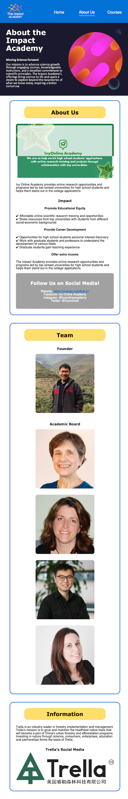
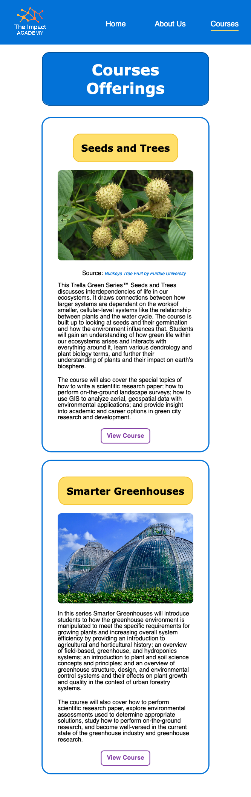
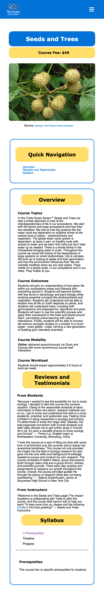
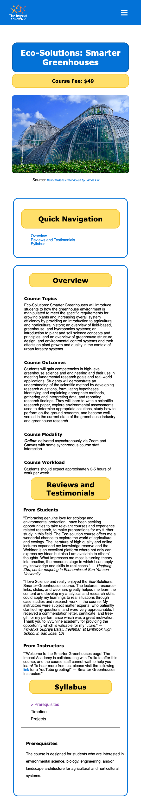

## Website Screenshots

A redesign of [Coscien's website](https://coscien.webflow.io/) by yellow-wolves, a team of 5 students taking INFO 1300, Introduction to Web Design and Programming.

Screenshots of the following webpages are shown below.

Made with HTML, CSS, JS.

#### Desktop screenshots
#### Home Page
  
#### About Page
  
#### Course Overview Page
   
#### Seeds Course Page
   
#### Greenhouses Course Page
   

#### Mobile Screenshots

#### Home Page
  
#### About Page
   
#### Course Overview Page
   
#### Seeds Course Page
  
#### Greenhouses Course Page
  
