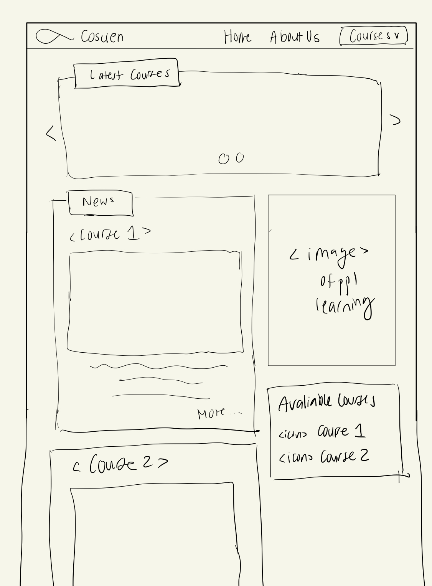
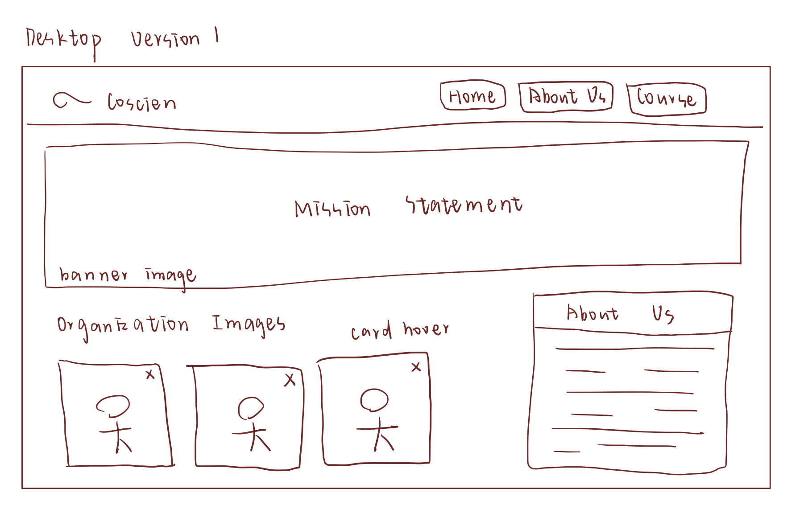
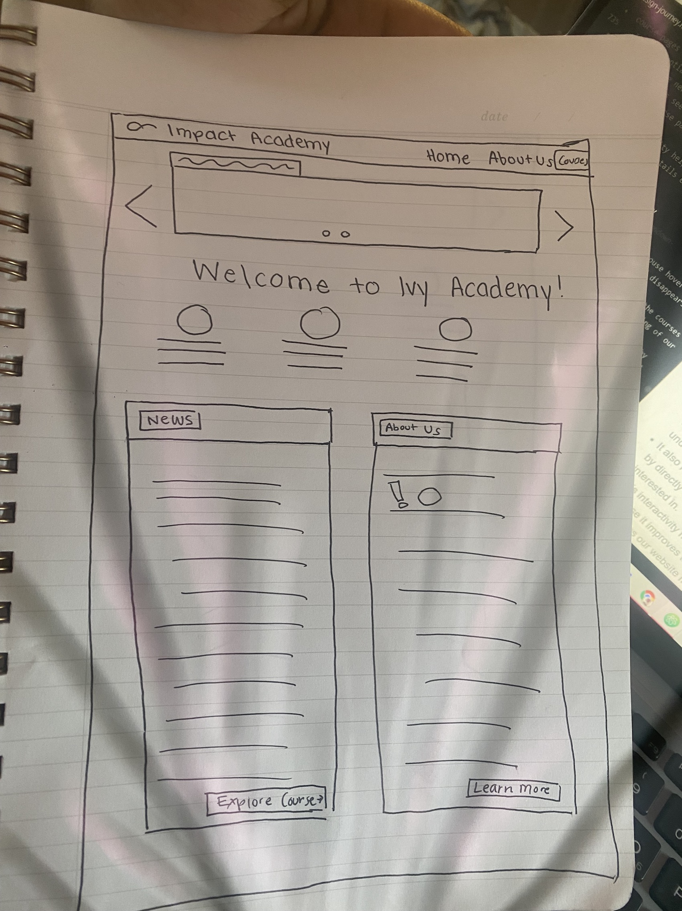
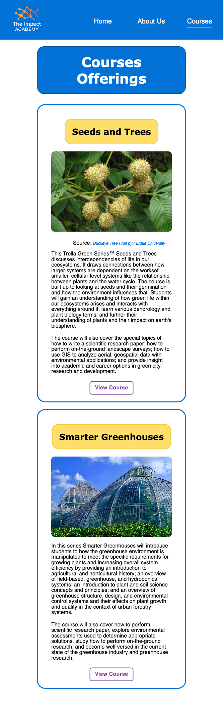
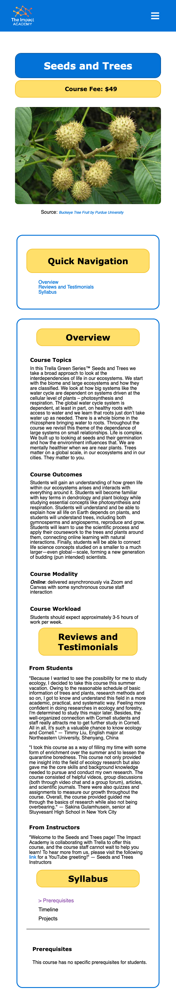
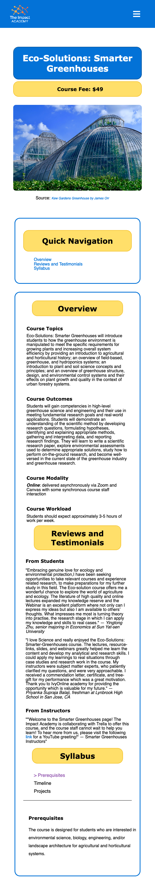
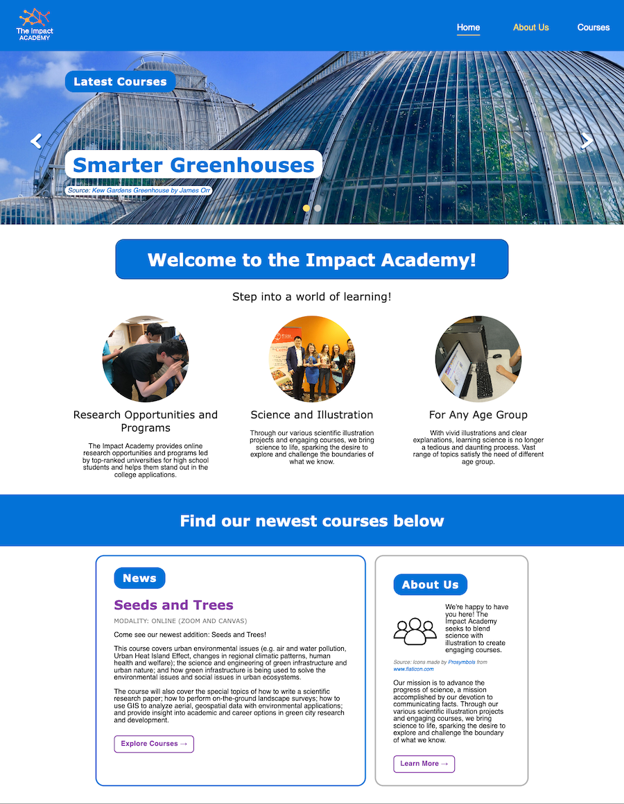
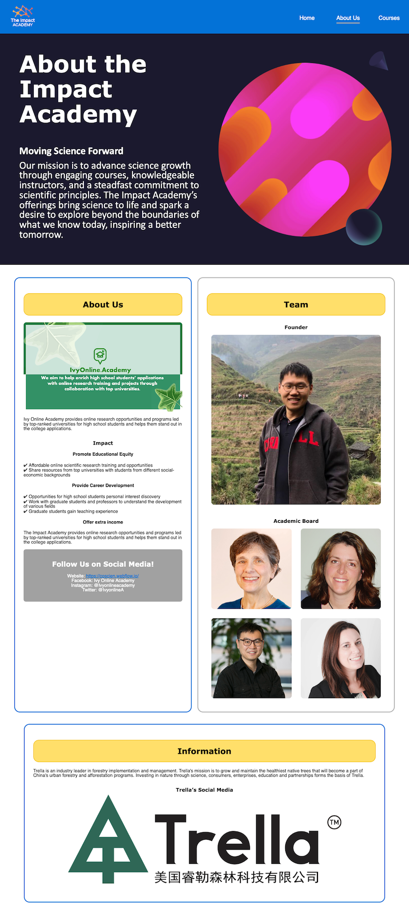
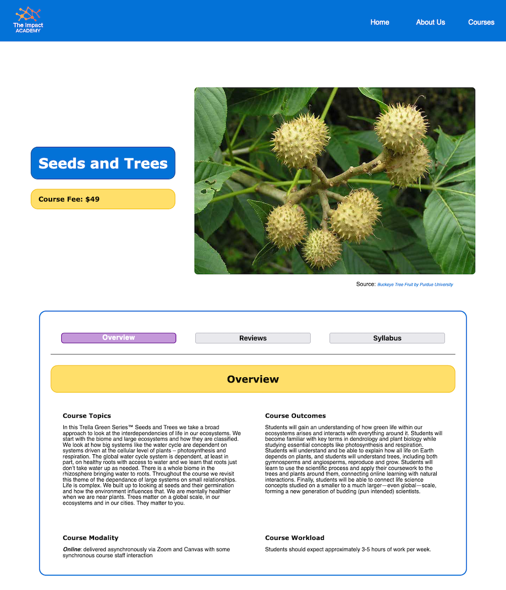

# Group Project: Design Journey

**You are encouraged to work ahead on everything on this project.** (Though we suggest you hold back on the interactivity until Project 3.) **Each section is required for a specific milestone. You are required to have these sections completed before that milestone's deadline.**

**Be clear and concise in your writing.** Bullets points are encouraged.

**Everything, including images, must be visible in Markdown Preview.** If it's not visible in Markdown Preview, then we won't grade it. We won't give you partial credit either. This is your warning.


# Client (Milestone 1)

## Client Questionnaire (Milestone 1)

1. Describe your organization and its purpose.

    - CoScien is a new initiative that aims to bring artists and researchers together to help the latter visually represent their work, given that research papers are very hard for the general public to understand.

2. What makes your organization and its services special or unique?

    - CoScien's idea is unique because we are helping researchers visualize their work, thus spreading research through art. For example, we let art students create cartoons that can explain the researchers’ projects.

3. What would you like for the update to your existing site? Why are you looking for this update?

    - Design course pages for the CoScien website based on IvyOnline.academy, which is linked with the Civic Ecology Lab.
    - Display the courses on the CoScien website.
    - Make the website look less boring.

4. Who do you want to visit your site? Who is your site's target audience?

    - Our target audience consists of researchers, college students, and high school students who are interested in the field or want to boost their college preparation/applications.

5. When visiting your site, what actions do you want your visitors to take?

    - When the visitors click “Courses”, they will be able to enter the course list page.
    - On the course list page, they will choose courses from different subjects, read the introduction of the chosen course, view the picture containing the background information, download the course syllabus, sign up and pay for the course through a shopping cart.
        - Note: The team explained that some of these functions are not possible with static websites.

6. What are your goals for this site? What are your goals for the visitors?

    - We want our site to connect art students with researchers. We also want them to cooperate and provide courses to the general public.
    - We want our visitors to be interested in our mission and take the courses.

7. Is there a "feel" that you want for your site? Are there colors or imagery or themes that you have in mind?

    - We desire a more vibrant and potentially modern style for the website.
    - The themes don’t need to match with the theme of other existing pages.

8. What are your favorite competitors or similar organizations' sites? Why?

    - edX, Coursera, etc.
    - They also present online courses in an interactive way. The main difference is that students use their platforms to learn, but we will conduct the online courses through Canvas.

9. What resources (images, information, content, etc.) do we have available while we are making a website, and where can we find them? Can you provide us with a high-quality image file of your logo?

    - Syllabi of the courses
    - General information about the courses
        - Similar structure can be found on IvyOnline website

10. Is there anyone else we should talk to in order to gain more information about your organization?

    - Mi is the primary contact.
    - Partner information will be sent through email. It is a Chinese industry related to forestry.

11. What expectations do you have for your website (clarify what we cannot do if they bring up something beyond the project’s scope)?

    - Organize the courses into different subjects/categories (like environmental sciences, information sciences, and social sciences).
    - Include detailed introductions for the courses, pictures containing background information,  syllabi, sign up buttons
    - The functions of shopping cart and signing up for the course are beyond our scope.

12. Will we have access to your existing website prototype?

    - Coscien website: https://coscien.webflow.io
    - Civic Ecology Lab: https://www.civicecology.org

13. Do you have any other questions?

    - IvyOnline has changed names to Impact Academy
    - No other major points were raised.


## Client Description (Milestone 1)
> Tell us about your client. Who is your client?
> Explain why your client meets the client rules in the project requirements.

Research papers are difficult for the general public to process and understand, so CoScien—our client—aims to bring artists and researchers together for the purpose of helping the latter communicate their work through engaging visuals. In addition to facilitating these collaborations, CoScien also provides courses developed by the artist-researcher pairings, ensuring broad access to a quality education. Our focus for this project will be on their course-creation initiative.

CoScien, who was presented to my group by course staff, meets every requirement outlined for the project. Importantly, the client is an Ithaca-based business/educational initiative—the requirements list describes this category as "fair game"—with whom no group members have ties or relationships. As such, CoScien is an external client that can provide unbiased feedback.

As an additional note, my group has clearly and proactively communicated to the client that the project scope only covers static websites, that we will meet need at least three times, and various other logistical details.


## Client Website (Milestone 1)
> Tell us about the website that your client wants. Tell us the purpose of the website and what it is all about.
> NOTE: **If you are redesigning an existing website, give us the current URL and some screenshots of the current site.** (FireFox makes it easy to take a full screenshot of a page.) Tell us how you plan to update the site in a significant way that meets the project's requirements.

  We are currently redesigning https://coscien.webflow.io/.

  
  

  We plan on updating the site by adding pages for courses, company partners (about page), and several other additions that help convey CoScien's mission to move science forward through the use of illustration. To this end, we will use INFO 1300's design principles and patterns, add interactivity, and focus on designing an ambitious website that meets the needs of our users.

  The purpose of the website is to inspire its audience to advance science by communicating research through a combination of scientific illustration projects and engaging courses. CoScien aims to spark desire in exploring and transcending the boundaries within scientific fields. It invites its audience to find the best illustration medium, join as an illustrator, and advance their own grasp on science.


## Client Website Scope (Milestone 1)
> Your project should be ambitious, but not too large. A good rule-of-thumb is that you should have about 1 content-full page for each team member.
> Explain why the website you will create for your client isn't too small and isn't too big. Explain why you think it's the right size for this project.

We plan to create five pages focused on displaying courses that our client, CoScien/Mi, would like the website to outline and share. We are thinking of having a landing page, several course pages, and, finally, a page noting the company’s partners.

Our website has several topics of focus: the landing page/introduction page, courses pages, and partners page. This means that we have a lot of content to cover and makes our site ambitious, meaning that it is definitely not too small. It is also not too big because it focuses on a specific part of the company’s offerings—its courses—and doesn’t try to implement too many unrelated topics or too much content on one page. These pages give us ample room to apply design principles and interactivity. Since we have several pages, we could potentially create a hamburger bar which compresses the navigation on the mobile version of the website. We could also include sliders of different course offerings on the home page. By focusing on these pages, we can polish our work and won't be spreading ourselves too thinly.


## Client Goals (Milestone 1)
> What kind of website do they want? What are their goals for the site?
> There is no required number of goals. You need as many goals as necessary to reflect your client's desires.

- CoScien wants to build up a business educational website that is informative and visually engaging (modern, vibrant, etc.). Specifically, they want to include detailed introductions for the courses and related syllabi. The website should also organize courses into different subjects and categories such as the environmental and social sciences.

- Goal A: They would like their website to connect art students with existing researchers.
- Goal B: They want the researchers and artists to cooperate with each other to provide courses to the general public.
- Goal C: They want their site visitors to be interested in their mission and, after reviewing relevant information (syllabi, costs, etc.), take the provided courses.


## First Client Meeting Minutes/Notes (Milestone 1)
> Include your notes/minutes from the client meeting.

- CoScien (client) representative: Mi Yan
    - Husband of Dr. Yue Li (the research associate who helped Professor Harms link us with CoScien)
    - Pursuing master's degree in Cornell's Department of Natural Resources
        - Plans to graduate next summer
- Project client is CoScien
    - New initiative
    - Helps to link artists with researchers so that academics can visualize their work for publications and more (helps to make research easer to understand)
    - Unique approach of company: spread research through art (often created by students) like cartoons
    - Focus for team: design pages within existing CoScien website for courses
    - Wants to move Cornell Ecology Lab's IvyOnline—soon to become Impact Academy—to CoScien website and redesign it so that high school/college students can learn and better understand content
        - Client plans to restructure IvyOnline to become part of CoScien’s platform
        - Primary aim of courses page: promote impact of research by developing mini-course that marries the work of artists and researchers
- CoScien’s mission
    - Pair a researcher with an artist, share fruits of labor on online
        - Example: Li, Y., & Krasny, M. E. (2020) — paper on the development of professional networks among environmental educators
        - IvyOnline portion (which we will work on) is intended to provide courses about the basics of published scientific research
            - Information/content related to these courses will be provided by the client
        - Several different course categories (social sciences, information/data sciences, life sciences)
        - An example of the content needed for each course: IvyOnline/Cornell Ecology Lab's Nature Education course.
        - Client's goals for website portion:
            - Connect art students with researchers, have the pairs work together to provide courses online (with a more specific target audience)
            - Interest visitors in the organization's missions
            - Convince visitors to take the course
            - Have a modern-looking website
- Client's vision for website content
    - Basic information about each course, ability to download syllabus, use shopping function on website
        - Client noted that people are not learning on website—they find information and sign up on website, learn on a Canvas course
        - Team explained that some features (including the shopping function) are beyond the scope of the project and cannot be completed
        - Team explained the concept of a static site
    - If visitors/users click on a course subject/category (math, computer science, environmental studies, etc.), they can select a specific course and learn more information about it.
        - Some information on website: introduction, picture with background information, syllabus, etc.
    - Client envisions the structure as: Course landing page, Course subject page, Course 1 (Greenhouse Course), Course 2 . . . Course "n"), About the instructors/partners, etc.
        - Explained that the final structure may look slightly different based on card sorting and other parts of the design process but that we will keep the client's vision in mind
        - Explained that we would likely only be able to tackle five pages or a bit more
    - Wants website to look modern and fun—appeal to a younger audience
        - Client said that themes do not need to match existing pages
    - Target audience: courses are available to the general public, but the target audience consists of researchers, college students, and high schoolers—in essence, academics—interested in the courses' subjects.
    - Similar/comparable websites
        - edX, Coursera, etc.—also provide online courses in a simple and modern way
        - Key difference: edX and Coursera actually teach on website, CoScien's website just aims to provide basic information (actual teaching happens on Canvas)
- Miscellaneous notes
    - Mi is the primary contact, but we can also contact CoScien's partner (a Chinese company related to forestry) about course material—link will be provided in an email from client
    - Told client that he could email the entire group or just me (client communicator) and that I'd pass things along
    - Existing website prototypes:
        - CoScien's website: https://coscien.webflow.io
        - Civic Ecology Lab's course page: https://www.civicecology.org
    - IvyOnline is now Impact Academy because of trademark issues


# Plan/Schedule (Milestone 1)
> Make a plan of when you will complete all parts of this assignment.
> This plan is for your team. There is no required format. Format it so that it works for you!

11/10 — Complete Milestone 2 informally (user interviews, content justification, design ideas, etc.)

11/17 — Content completed in HTML

11/20 — Design and layout completed through CSS

11/24 — Add interactivity

11/28 — Finish user testing

11/30 — Finish revisions based on user testing

12/01 — Check over design journey work


# Site Design/Plan (Milestone 2)

**Make the case for your decisions using concepts from class, as well as other design principles, theories, examples, and cases from outside of class.**

You can use bullet points and lists, or full paragraphs, or a combo, whichever is appropriate. The writing should be solid draft quality but doesn't have to be fancy.

## Understanding Users (Milestone 2)

### Audience (Milestone 2)
> Briefly explain your site's audience. Be specific and justify why this audience is a cohesive group with regard to your client's site. This audience should not be overly broad nor arbitrarily specific. It should be a cohesive group with similar _goals_.

Our site's target audience consists of postsecondary and advanced secondary students who are interested in taking online courses. Students in this advanced group have the educational background and approach to learning that is expected of those taking CoScien's online courses, and they also have similar needs. At the aforementioned stages of learning, students tend to seek out online courses because they hope to clarify their knowledge of an area already studied, explore a subject of interest (could investigate new areas of applied research, choose a major, etc.), or gain credentials for resumes/jobs. Based on these interests, their goals for the website are likely quite similar, including finding information about the courses' delivery methods, certifications, expected outcomes, etc. Note that this group is not arbitrarily expansive, as the goals listed above hold true for those in both groups. It is difficult to say that those who are postsecondary students would be considerably better equipped to understand course content (and therefore more interested in using the product/visiting the course website). Please note that the audience is also not too specific. Younger students, especially those in elementary and middle school, would likely struggle with the course material and delivery methods, so they are unlikely to even attempt to consider these online courses as well. As such, they are not part of our target audience. Additionally, for this younger demographic, parents—not the students themselves—typically help to find information about online courses. The goals of these parents, which are often just to find fun courses for their children, do not align with those of high schoolers and college students using online courses (typically to learn more about a new area of interest, shore up resumes with certificates, prepare for a specialized job, etc.). Therefore, these parents also do not fall in our target audience. Finally, the general population (or even just the general population interested in online courses) do not fall in our target audience. CoScien's primary goal in making these courses is to help people academically, and in doing so, their courses are uniquely designed to be visually engaging to students. As such, the CoScien course product is not tailored towards who have already completed their education, so they also do not fall in our target audience. Thus, our target audience is neither too broad nor too specific.


### User Interview Questions (Milestone 2)
> Plan the user interview which you'll use to identify the goals of your site's audience.

**User Interview Briefing & Consent:** Hi, I am a student at Cornell University. I'm currently taking a class on web design and for a project I am (re-)designing a web site for _client's name_. I'm trying to learn more about the people that might use this site. May I ask you a few questions? It will take about 10-15 minutes. You are free to quit at any time.

1. Please tell me a little bit about yourself. Eg. your grade, major, hobbies
2. What is the most recent online course you’ve taken or are interested in taking?
3. What brought you to take the course?
4. What is the course website you took the course on? How did you find out about the course/course website?
5. Before exploring a course to take, what information did you look for?
    - Where did you look for this information?
6. Was there an online course you decided not to take?
    - Was there a reason why you didn’t choose it?
7. Have you taken multiple online courses/are interested in multiple online courses?
    - What were the differences between <these two courses>?
    - What did you enjoy most about <course 1>? <course 2>?
8. What are some concerns and considerations that you have before taking an online course?
9. Was there any information that you could not find on a course’s website that you would have found helpful?
10. Is there any information you wish you had known about the course beforehand or information that you weren't able to find?
11. Is there anything related that we didn’t ask you but you would like to mention?

**After the interview:** This was really helpful. Thank you so much for agreeing to speak with me today. Have a great day!


### Interview Notes (Milestone 2)
> Interview at least 4 people from your audience. Take notes and include those notes here. Make sure to include a brief description of each interviewee.

**Interviewee 1:**

Description: A CS student at Stanford
Notes:
**User Interview Briefing & Consent:** Hi, I am a student at Cornell University. I'm currently taking a class on web design and for a project I am (re-)designing a web site for CoScien. I'm trying to learn more about the people that might use this site. May I ask you a few questions? It will take about 10-15 minutes. You are free to quit at any time.

1. Please tell me a little bit about yourself. Eg. your grade, major, hobbies
    - I am a CS student at Stanford and I like digital painting and cryptocurrency.
2. What is the most recent online course you’ve taken or are interested in taking?
    - I have recently taken CS50 in Highschool.
3. What brought you to take the course?
    - My psychology teacher made it a requirement for us to take during our time in class because she found resource in which we were able to learn CS for free through Harvard.
4. How did you find out about the course/course website?
    - My Psychology teacher emailed it to us.
5. What is the course website?
    - https://cs50.harvard.edu/
6. Have you taken multiple online courses/are interested in multiple online courses?
The only instance in which I took online courses was when I had to take courses for school at Stanford online.
    - a. What were the differences between <these two courses>?
        - Stanford courses were held over zoom as opposed to having videos uploaded on the course website
    They had more information in the syllabus about the course but didn't mention difficulty like CS50.
    - b. What did you enjoy most about <course 1>? <course 2>?
        - I enjoyed that course 1 was asynchronous. I enjoyed the topics of the stanford courses better though, and the work pace.
7. Before exploring a course to take, what information did you look for?
I was looking for how difficult this course would be and how much time it would take
    - Where did you look for this information?
        - I went to the FAQ section on the toolbar for CS50
8. What are some concerns and considerations that you have before taking an online course?
    - I wanted to make sure I had enough time to take the course and I also wanted to make sure that it didn't require any previous knowledge in coding.
9. Was there any information that you could not find on a course’s website that you would have found helpful?
    - I wish that the website explicitly said that no prior programming knowledge is required, even though the videos said that explicitly.
10. Is there anything related that we didn’t ask you but you would like to mention?
I guess I thought the harvard website didn't look very professional. It looked like a student coded it from scratch as the fonts and coloring were very unappealing.


**After the interview:** This was really helpful. Thank you so much for agreeing to speak with me today. Have a great day!


**Interviewee 2:**

Description: A Communication major student at Cornell.
Notes:
1. Please tell me a little bit about yourself. Eg. your grade, major, hobbies
    - Xinyu Hu. Sophomore student at Cornell University, majoring in Communication and Information Science. She is pretty interested in Music, reading, writing, and ASMR.
2. What is the most recent online course you’ve taken or are interested in taking?
    - Coursera, Introduction to Psychology (Yale) and Financial Accounting (Upenn)
3. What brought you to take the course?
Incentive: It’s free. She does not need to pay tuition to learn something for free.
    - Collaboration between universities and educational platforms.
    - Coursera also offers certification so that she will be able to add it as an experience in Linkedin
    - Coursera also offers scholarships for those who need financial aid
4. What is the course website? How did you find out about the course/course website?
    - Coursera.
    - Coursera’s promotion social media, e.g., ads
    - Some of her classmates recommended her about the variety of courses offered in Coursera.
5. Before exploring a course to take, what information did you look for?
    - a. Where did you look for this information?
        - She pays special attention to the course ratings on Coursera and the hosting educational institution for the course. She also looked for the number of students enrolled in this course. Besides that, she really cares about the instruction mode for the class: asynchronous or synchronous.
6. Was there an online course you decided not to take?
    - a. Was there a reason why you didn’t choose it?
        - The main reason why she decided not to take some of the online courses is that she doesn't want to pay tuition fees. In addition, she’s a full time student at college so she does not have enough time to take part in courses that seem to be extra work for her. Also, she has different priorities when selecting courses that she wants to take: she will prioritize the course (Financial Accounting) because it serves as an essential career toolkit and helps her land a job.
7. Have you taken multiple online courses/are interested in multiple online courses?
    - Yes. She is interested in taking multiple courses together and she will be able manage and balance her workload.
    - a. What were the differences between <these two courses>?
        - She took Psychology for interest, but she took financial accounting for recruiting purposes.
    - b. What did you enjoy most about <course 1>? <course 2>?
        - The professor of Psychology is pretty engaging.
        - The course is separated into different clips. Great animation to attract student’s attention.
        - The course is also pretty interactive.
        - Financial accounting contains a lot of interesting topics, and it is not at all dreary.
8. What are some concerns and considerations that you have before taking an online course?
    - She’s afraid that she will procrastinate when attending online courses.
    - She is concerned about being less connected when taking online courses, and the course is not consecutive in nature. She has to divide the courses into different periods if she decides to take the online course because she is super busy.
9. Was there any information that you could not find on a course’s website that you would have found helpful?
    - The traditional syllabus and course introduction are long and dreary, and take a lot of time and effort to glance through. She hopes that the syllabus could be shorter.
10. Is there any information you wish you had known about the course beforehand or information that you weren't able to find?
    - She hopes that the course webpages can offer a concise syllabus and course description.
11. Is there anything related that we didn’t ask you but you would like to mention?
    - No


**Interviewee 3:**

Description: A male CS student at Columbia University

*User Interview Briefing & Consent:** Hi, I am a student at Cornell University. I'm currently taking a class on web design and for a project I am redesigning a web site offering online courses to high school students and college students. I'm trying to learn more about the people that might use this site. May I ask you a few questions? It will take about 10-15 minutes. You are free to quit at any time.

1. Please tell me a little bit about yourself. Eg. your grade, major, hobbies
    - Daniel Indictor, College Sophomore, Electrical Engineer, Cycling, programming, electronics.
2. What is the most recent online course you’ve taken or are interested in taking?
    - Last semester, took a writing course, intro electrical engineering course, computational linear algebra course, data structures course, and PE course online.
    - Took them through my university. Used Courseworks, Edstem, Gradescope, and lots of Zoom.
3. What brought you to take the course?
    - Required for major.
4. What was the course website? How did you find out about the course/course website?
    - Courseworks
    - The university gives a list of courses I'm required to complete to get an EE major these courses were all on that list.
5. Before exploring a course to take, what information did you look for?
    - Instructor reviews, syllabi, and textbooks used in the class.
      - a. Where did you look for this information?
          - Either through courseworks, word of mouth, RateMyProfessor, internal rating tool.
6. Was there an online course you decided not to take?
    - a. Was there a reason why you didn’t choose it?
7. Have you taken multiple online courses/are interested in multiple online courses?
    - a. What were the differences between <these two courses>?
      - Linear algebra course: lots of numbers inside each letter
    - b. What did you enjoy most about <course 1>? <course 2>?
      - EE course: only one number inside the letter, though that number depends on other numbers inside letters.
8. What are some concerns and considerations that you have before taking an online course?
    - Most important: synchronously, whether it's recorded. Synchronous=bad and recorded=good.  Also important: exam format (open book, take home, etc)
9. Was there any information that you could not find on a course’s website that you would have found helpful?
    - Lots of courses didn't have a syllabus or other information available until they already started, which made choosing courses more difficult.
10. Is there any information you wish you had known about the course beforehand or information that you weren't able to find?
    - Just the syllabus
11. Is there anything related that we didn’t ask you but you would like to mention?


**Interviewee 4:**

Description: An international student from Zhejiang University International Campus, major in computer engineering

Notes:
**User Interview Briefing & Consent:** Hi, I am a student at Cornell University. I'm currently taking a class on web design and for a project I am (re-)designing a web site for CoScien. I'm trying to learn more about the people that might use this site. May I ask you a few questions? It will take about 10-15 minutes. You are free to quit at any time.

1. Please tell me a little bit about yourself. Eg. your grade, major, hobbies
    - Junior at Cornell
    - Computer engineering
    - A Cappella, Mountain bikes

2. What is the most recent online course you’ve taken or are interested in taking?
    - An A Cappella course.

3. What brought you to take the course?
    - He leads an A Cappella group and he wants to learn skills of singing and managing the group.

4. What is the course website you took the course on? How did you find out about the course/course website?
    - It doesn't have a website. He receives zoom links through Wechat.
    - He discovered this course on a Wechat public account.

5. Before exploring a course to take, what information did you look for?
    - The schedule
    - Whether the topic matches his interest
    - The experience of teachers
    - The certification and outcome
    - Course fee
    - Whether it's a recording-based course or live-streaming course
    - a. Where did you look for this information?
        - On their official account

6. Was there an online course you decided not to take?
    - He dropped an online course called Intro to Machine Learning on Coursera
    - a. Was there a reason why you didn’t choose it?
        - He was too busy.
        - He was not interested in this topic.
        - He didn't pay for the course, so he could drop it without cost.
        - Coursera is a well-developed platform but its discussion board has a lot of unhelpful messages. For example, it displays messages several years ago.

7. Have you taken multiple online courses/are interested in multiple online courses?
- He was interested in two courses but he didn't take them.
    - a. What were the differences between <these two courses>?
        - They are under two different majors. One is about machine learning, and the other is about orchestra.
        - He cares about the topic very much.
    - b. What did you enjoy most about <course 1>? <course 2>?
        - He didn't take them.

8. What are some concerns and considerations that you have before taking an online course?
    - Course quality (Coursera has generally high-quality courses)
    - Workload
    - Outcomes

9. Was there any information that you could not find on a course’s website that you would have found helpful?
    - He could not find the discussion board
    - He could not find advice on the assignments

10. Is there any information you wish you had known about the course beforehand or information that you weren't able to find?
    - similar to question 8

11. Is there anything related that we didn’t ask you but you would like to mention?
    - No.

**After the interview:** This was really helpful. Thank you so much for agreeing to speak with me today. Have a great day!


**Interviewee 5:**

Description: A freshman at the University of Pennsylvania majoring in Biology and French

Notes:
1. Please tell me a little bit about yourself. Eg. your grade, major, hobbies
    - Freshman at UPenn (Biology/Francophone studies)
    - Hobbies: baking, singing, going on walks at Penn Park

2. What is the most recent online course you’ve taken or are interested in taking?
    - Udemy Dr. Angela Yu's Swift/iOS development course (iOS 13 version)

3. What brought you to take the course?
    - Wanted to learn more about app development (developing/emerging field)
    - Planned to enter high school government-sponsored competition for app development (senior year)

4. What is the course website you took the course on? How did you find out about the course/course website?
    - Took course on Udemy
    - First looked through Coursera (didn't find anything particularly relevant)
    - Looked through Udemy and saw that Dr. Yu's course had a high rating with many reviews

5. Before exploring a course to take, what information did you look for?
    - Relevant course content in modules
        - Covers basics for strong foundation but not inaccessible to beginners
    - Time commitment
    - Updates for iOS versions/new content

6. Was there an online course you decided not to take?
    - All of the courses on Coursera that he explored were less relevant than the Udemy one

7. Have you taken multiple online courses/are interested in multiple online courses?
    - Already taken others
        - Coursera: took Miracles of Human Language (linguistics course) a few years ago, pretty large pool of ratings with good reviews, short and interesting content
        - Wanted to take other courses like Laurie Santos' happiness class

8. What are some concerns and considerations that you have before taking an online course?
    - Considerations:
        - Time commitment
        - Breadth of content
    - Concerns:
        - Must be engaging! Fun lecturers, some kind of student-professor interaction

9. Was there any information that you could not find on a course’s website that you would have found helpful?
    - Didn't really know what else to look for besides the aforementioned information that was already on the websites
    - Most information was pretty up-front, knew that everything would be self-paced

10. Is there any information you wish you had known about the course beforehand or information that you weren't able to find?
    - Not really. Most important information was either explicitly stated or common sense.

11. Is there anything related that we didn’t ask you but you would like to mention?
    - Nope!

**After the interview:** This was really helpful. Thank you so much for agreeing to speak with me today. Have a great day!


### Goals (Milestone 2)
> Analyze your audience's goals from your notes above. List each goal below. There is no specific number of goals required for this, but you need enough to do the job (Hint: It's more than 1 and probably more than 2).

Goal 1: Gauge the quality of the course itself and its instructor.
- **Design Ideas and Choices** _How will you meet those goals in your design?_
  - Include a comment section below the course that displays reviews from students who have taken the course previously.
- **Rationale & Additional Notes** _Justify your decisions; additional notes._
  - In question 5: "Before exploring a course to take, what information did you look for?", Interviewee 3 specified that he looked specifically for instructor reviews either through word of mouth, RateMyProfessor, or an internal rating tool. Clearly students want to know how other students feel about the course so they can gauge its quality and know what to expect from it and the professor teaching course.
  - A comment section that displays reviews from students who have taken the course previously would easily address this goal because students will be able to know other student's opinion of the course directly.

Goal 2: Learn what is expected if they enroll in the course.
  - Example: Course topics, schedule, course fee, and workload.
  - The syllabus, exam format, if it's synchronous or asynchronous.
- **Design Ideas and Choices** _How will you meet those goals in your design?_
  - Include these content in the course web pages
  - Attach the syllabus or a link to the syllabus in the course web page
  - When the users click on these items, the content will pop up
- **Rationale & Additional Notes** _Justify your decisions; additional notes._
  - Based on the feedback of interviewee 4, the information of course topics, schedule, course fee, workload, and instruction mode is important to him when he is exploring a course.

Goal 3: Assess expected outcomes before taking the course.
For example, skills gained, contribution to a major or if they get a certificate.
- **Design Ideas and Choices** _How will you meet those goals in your design?_
  - We are going to provide users with a general information list that debriefs course information, forbidden overlaps, when offered, and comments.
- **Rationale & Additional Notes** _Justify your decisions; additional notes._
  - Based on the responses provided by interviewees, students would like to know the benefits of the course if they will enrolling in it. For example, Interviewee 3 wanted to know if the course would contribute to his major and Interviewee 2 and Interview 4 both wanted to know if the course had a certification at completion.

Goal 4:  Navigate the courses and course details easily and efficiently (syllabus, notes, etc.) by minimizing scrolling, grouping similar information, and implementing concise content.
- **Design Ideas and Choices** _How will you meet those goals in your design?_
  - We are planning to implement a concise version of the syllabus to make it seems more straightforward.
  - We are also planning to make the course pages easily accessible from the navigation bar so users don't need to search far to find where to learn more about the courses offered.
- **Rationale & Additional Notes** _Justify your decisions; additional notes._
  - Based on the feedback provided by interviewee 2, we decided a shorter and concise syllabus is pretty necessary because it saves users a lot of time and effort.
  - Students also clearly want to learn about the course they are going to take when considering whether or not to take it. Thus being able to navigate to a page which provides users the details about the course is essential.

Goal 5: To use a website that is both functional and aesthetically professional by ensuring that theming is consistent and the website  is readable.
- **Design Ideas and Choices** _How will you meet those goals in your design?_
  - We are planning to use user-oriented design for our website that maintains a clean but engaging aesthetic to our website by using appropriate spacing, fonts, and CSS styling. We wish to make the user think less about the website in order to maintain functionality and efficiency. We will avoid color schemes that do not fit well together, informal/playful fonts, and will do user testing to get feedback about the styling.
- **Rationale & Additional Notes** _Justify your decisions; additional notes._
  - It is important to create a website that looks appealing because it attracts users to view the course page more seriously. During my interview (interview 1), my interviewee spoke about how strange it was that a Harvard website felt as if it were coded by a student.


## Content Planning (Milestone 2)

**Plan your site's content.**

### Your Site's Planned Content (Milestone 2)
> List the content you plan to include your personal website. This should be a comprehensive list.

- Slideshow of courses offered
- Organization images
- Welcome message
- News about courses
- Cards of the people in the organization
- Website mission statement
- Overview of courses offered
- Information about partners
- Logo of partners
- Banner images
- When the courses are offered
- Introduction to courses
- The size of courses
- The outcomes of courses
- The timeline of assignments and topics
- Instruction mode
- Prerequisites
- Exam formats
- Cost of courses
- Students' reviews/testimonials
- Introduction of professors
- Course topics
- Expected workload
- Syllabi
- Decorative images
- Navigation
- Contact information
- Logo of Impact Academy


### Content Justification (Milestone 2)
> Explain (about a paragraph) why this content is the right content for your site's audience and how its addressed their goals..

This content is right for our site's audience because our site's audience are students who are interested in taking online courses. Thus, it should only be right for us to advertise the course material via banner images and provide ample information about the courses, including their schedules, instructors, topics, syllabi, etc. We also find it important for students taking the course to learn more about the company offering the courses in order for them to feel as though they are learning from a reputable source, thus building trust between the students and the company. This is why we included content like CoScien/Impact Academy's logo and mission statement.

More specifically, our group's user interviews helped us identify the five aforementioned audience goals, and our content helps achieve complete coverage of these needs. First, we include information about CoScien to help users learn about the instructors and organization. Without information about the people offering the online courses—including biographies, headshots, organizational images, partners, and a mission statement—people are unable to accurately assess the quality of a course before enrolling, which is the very first goal listed above. Given that this consideration is especially salient for new course hubs charging enrollment fees, users must have basic information about CoScien/Impact Academy to understand and trust the organization and its courses. This basic information also includes contact information, as users need to be able to reach out if they have questions or concerns before enrolling.

Additionally, our users specifically asked for logistical and overview information to be provided. This includes details about predicted workloads, exam schedules, course fees, assignment types, outcomes, prerequisites, feedback, instruction modes, and more. In essence, before committing to a course, users in our target audience seek to learn more about the time commitment and course structure. This helps them evaluate if the course is an ideal fit for their schedule and learning needs, and our listed content covers virtually every point mentioned in the interviews.


## Information Architecture (Milestone 2)

### Content Organization (Milestone 2)
> Document your iterations of card sorting here.
> Include photographic evidence of each iteration of card sorting and description of your thought process for each iteration.

###First Iteration

  - Our first iteration of card sorting led to the creation of five different content groups entitled "Home," "Course 1," "Course 2," "About," and "Every Page." As the name would suggest, the content in the "Every Page" group was necessary for every page on our site. These pieces of content (like the logo in our navigation bar) naturally belonged on every page, as they were crucial to the cohesiveness of the website. Dividing the rest of the content was similarly intuitive. The "Home" group contained most of the content usually found on a home page, including news, welcome statements, and more. However, unlike the other two iterations, this version of card sorting also featured some course information in the "Home" group, including basic overviews and background information of each course. However, my group found this grouping method to be cluttered. Some information pertinent to specific courses was found in the "Home" group and not in the "Course 1/2" groups, making it difficult for users to predict where important content would be found. Additionally, home pages are generally supposed to be somewhat lean in that they should not feature content that could be placed on a different page. As such, we scrapped this iteration in favor of another.

Because the pictures are a bit unclear, here are key components that we put in each group:

  - Home Page
      - Slideshow of courses
      - Timeline of assginements and topics
      - Introduction to Greenhouse Course 1
      - Banner image
      - Overview of courses offered
      - Background information about courses
      - Decorative images
      - When courses offered
  - Course Page 1
      - Sidebar for Course 1 syllabus
      - Course 1 size
      - Course 1 fee
      - Course 1 reviews
      - Course 1 topics
      - What you will learn/outcomes
      - About instructors (course 1)
      - Course 1 prerequisities
      - Exam format for course 1
      - Expected workload for course 1
  - Course Page 2
      - Sidebar for Course 2 syllabus
      - Course 2 size
      - Course 2 fee
      - Course 2 reviews
      - Course 2 topics
      - What you will learn/outcomes
      - About instructors (course 2)
      - Course 2 prerequisities
      - Exam format for course 2
      - Expected workload for course 2
  - About Page
      - About us
      - Mission statement
      - Organization images
      - Biography card hover
  - Every Page
      - Logo
      - Navigation bar
      - Footer
      - Drop-down menu


###Second Iteration


  - In this iteration, we saw that the course pages were arguably a bit bloated with content and aimed to split course-specific content into four groups: "Course Page 1," "Course 1 Syllabus," "Course Page 2," and "Course 2 Syllabus." As such, this would create six total groups when accounting for the "Home" and "About" groups as well. When sorting information between the course page and course syllabus groups, we sought to envision typical Cornell syllabi and place information found on those syllabi in the syllabi groups. As such, content like prerequisites and course timelines were sorted into the syllabi pages. However, after sorting, the team felt that the distinctions between the two course page types felt slightly arbitrary. In other words, predicting which content would be found on the course page versus the syllabus page might not have been intuitive to some users. Additionally, because most other online learning websites like Coursera and edX have one page per course, we reasoned that separating course-specific information into two separate groups might be confusing to users unaccustomed to such organization (would make them "think").

Because the pictures are a bit unclear, here are key components that we put in each group:

  - Home Page
      - Slideshow of courses
      - Introduction to Greenhouse Course 1
      - Banner images for courses
      - Overview of courses offered
      - Background information about courses
      - Decorative images
      - When courses offered
  - Course Page 1
      - Course 1 size
      - Course 1 fee
      - Course 1 reviews
      - Course 1 topics
      - What you will learn/outcomes
      - About instructors (course 1)
      - Expected workload for course 1
  - Course Syllabus 1
      - Prerequisites for course 1
      - Timeline of assignments and topics for course 1
      - Sidebar
      - Exam format for course 1
  - Course Page 2
      - Course 2 size
      - Course 2 fee
      - Course 2 reviews
      - Course 2 topics
      - What you will learn/outcomes
      - About instructors (course 2)
      - Expected workload for course 2
  - Course Syllabus 2
      - Prerequisites for course 2
      - Timeline of assignments and topics for course 2
      - Sidebar
      - Exam format for course 2
  - About Page
      - About us
      - Mission statement
      - Organization images
      - Biography card hover
  - Every Page
      - Logo
      - Navigation bar
      - Footer
      - Drop-down menu


###Third Iteration


  - In this final iteration, we sought to address the overloading of the home page while keeping course-specific information on one complete page per course. In other words, this iteration helped to address both pitfalls of the preceding two iterations. First, we created five groups: "Home," "Course Landing Page," "Course 1," "Course 2," "About," and "Every Page." As with before, the "Every Page" group features basic content found on every page, and the "Course 1" and "Course 2" groups feature all information specific to their respective courses. This ensures that each page is a one-stop shop for all interested members of our target audience looking to learn more about a course. Please note that after conducting our initial card sorting, we decided to move the student reviews and professor information to the specific course pages. With this same reasoning of providing a one-stop shop for most course information, we thought that it would be best for users to read feedback/comments about a course on the respective course's page, as the landing page is primarily intended to be a redirection point. Additionally, the "About" page still features contact information and partner information, grouping information that helps users learn more about the organization. The key change from the first iteration lies in the division between the "Home" group and the "Course Landing Page" group. The home group primarily features basic information that welcomes users to the site, including a welcome message, brief about section and slideshow of courses. The "Course Landing" page group, however, features more detailed information about course background/topics as well as links to the various course pages.

Because the pictures are a bit unclear, here are key components that we put in each group
- Home Page
    - Slideshow of courses
    - Introduction to Greenhouse Course 1
    - Overview of courses offered
    - Decorative images
    - When courses offered (do not include)
    - About
- Course Landing Page
    - Banner images for both courses
    - Background information about both courses
    - About prof for both courses (moved to respective course page)
    - Student reviews for both courses (moved to respective course page)
- Course Page 1
    - Course 1 size (do not include)
    - Course 1 fee
    - Course 1 topics
    - What you will learn/outcomes
    - About instructors (course 1)
    - Expected workload for course 1
    - Prerequisites for course 1
    - Timeline of assignments and topics for course 1
    - Sidebar
    - Exam format for course 1
- Course Page 2
    - Course 2 size
    - Course 2 fee
    - Course 2 reviews
    - Course 2 topics
    - What you will learn/outcomes
    - About instructors (course 2)
    - Expected workload for course 2
    - Prerequisites for course 2
    - Timeline of assignments and topics for course 2
    - Sidebar
    - Exam format for course 2
- About Page
    - About us
    - Mission statement
    - Organization images
    - Biography card hover
- Every Page
    - Logo
    - Navigation bar
    - Footer (do not include)
    - Drop-down menu (do not include)
    - Mobile hamburger menu


### Final Content Organization (Milestone 2)
> Which iteration of card sorting will you use for your website?

We will use the third iteration.

> Explain how the final organization of content is appropriate for your site's audiences and their goals.

- The content organization for the home page is appropriate because it makes it very clear what the website is offering - online courses. It provides detailed information of one such course (the most recent course avaliable) so users don't have to search far in order to learn some information about the course's offerings. A rotating carousel with banner images of further courses allows users to explore more courses from the home page at ease. This addresses the audience's fourth goal (to navigate the course and course details effectively) and second goal (to learn what is expected of a course).

- In "About Us" page, the organization for content makes sense because it covers the information needed for a typical about us webpage. In this About Us page, we tend to tell the users the brand images, the organization images, and their partner's information. The page clearly correpsonds to audience's goal 1, which labels the instructors' background and information. Besides, it also identifies with goal 5, which indicates the webpage's functionality.

- The course overview page's content is appropriate because it accomplishes the goal of letting users see, the available courses in place and gain some brief information before going into specific courses. The brief information are as follows: course overview title + images of course (kind of like an introductory "banner") and course description (what will be learned). This helps with Goal 4, navigating the courses easily because users can view one course by clicking on the course overview title and then backtrack to view more courses in the course overview page.

- The organization of content for each course page is appropriate because it contains the various course components that users cited as being important in their user interviews and later information our audience goals. Specifically, users mentioned that the hoped to see information about quality of a course/course' intructor, fees, prerequisites, topics, schedule, workload, and outcomes. Importantly, the course page addresses each of these needs. The course fee included in both the "Course 1" and "Course 2" pages, as are reviews/testimonials from students and professors, workload estimates, topics, outcomes, and various other syllabus elements. By sorting each of these pieces of content into the courses pages, we are able to centralize all details about a course—whether they pertain to logistics or feedback—in its respective content group. This ensures that users can find all information about a course in one place, helping them achieve the audience goals listed above.

- Syllabi for two courses (contained within the their respective course pages): the syllabi consist of three parts: prerequisites, timeline, and the projects. These content are appropriate because they are what the users will expect to see in a syllabus, and are significant for the users who decide to enroll in this course. This addresses the audience's goal 2. Also, the syllabi separate the detailed information of a course from its general information, which addresses the audience's goals 4 and 5.

### Navigation (Milestone 2)
> Please list the pages you will include in your personal website navigation.

- Home
- About Us
- Courses
- Seeds and Trees
- Smarter Greenhouses

> Explain why the names of these pages make sense for your site's audience and their goals.

All of these page names are intuitive for our audience and achieve the central goal of information architecture: minimizing the need for our audience to "think" while using the website.

First, our homepage contains basic information about the CoScien/Impact Academy courses. It serves as a brief introduction to the organization, welcomes users to the site, and recent developments, among other things. In essence, it allows users to quickly glean information not specifically relevant to any one course, and approach to homepage content matches that of virtually any site on today's Internet. The "About Us" page intuitively talks about CoScien/Impact Academy, sharing details about partners and instructors. For users trying to learn more about instructors and the organization (first audience goal), they would intuitively click on this tab to learn about "us"—this refers to CoScien/Impact Academy. The course list page ("Courses") serves as a basic redirection to any course of interest. For users trying to learn more about a specific course (second, third, and fourth goals), they would first try to find said course from a list of all courses, hence the name. Next, users might try to find one of the client's specific courses, of which there are currently two. As such, we named the course pages containing information about specific offerings after their respective courses because they intuitively only contain information relevant to either "Seeds and Trees" or "Smarter Greenhouses." This naming choice makes clear that users visiting one of these pages should expect to find all information specific to one of these courses and exceeding little extraneous information, further helping them achieve the second, third, and fourth goals.

Say, for example, that someone wishes to find news about CoScien/Impact Academy's recent developments for the purpose of fulfilling the first audience goal. They would intuitively navigate to the homepage because the information does not pertain to any specific course. However, if they hoped to gauge the expected time commitment of the Smarter Greenhouses course, they would simply have to see that there is an entire page named "Smarter Greenhouses," suggesting that said page contains an exhaustive list of information about the course.


## Design (Milestone 2)

### Visual Theme (Milestone 2)
> Discuss several (more than two) ideas about styling your site's theme. Explain why the theme ideas are appropriate for your target audiences.
> Note the theme you selected for you site and why it's appropriate for the audience and their goals.

For our project, we considered three different theme ideas, namely a minimalist theme, a fun theme, and an urban/earthy theme.

The minimalistic theme's primary goal is cleanliness and reduction of visually distracting elements. As such, the base of the theme is a white background with black text. Our audience's goals for the website center around reading a variety of details about the CoScien/Impact Academy course offerings, so ensuring that the reading experience is easy on the eyes, which this theme achieves, is an important option for our theme selection. Additionally, minimalist themes very much match the modern and professional appearance of most popular online course websites like Coursera and edX, as frills and clutter make a website/product look less valuable as a means of learning (see the fifth audience goal listed above). In line with this goal of reducing frills, all text should feature one sans-serif font family for consistency, italicized text should be avoided for emphasis (bold text instead), and just one additional accent color should be used. Preferably, this accent color would be a bold color as opposed to a muted earthy tone, as it is the only splash on non-grayscale color on the page. The primary fear in implementing this theme, however, is that the appearance is too sterile and boring for the still-young audience that CoScien/Impact Academy hopes to capture, which would fail to address the fifth goal of our audience, which calls for an aesthetically professional and pleasing website.

The fun theme's primary goal is to balance clean design with punchier and more vibrant visual elements. As such, while the base of the theme is still a white background with black body text, headers and various other elements (navigation menu, captions, etc.) can feature a few other colors. The use of black text with a white background maximizes contrast (readability) for the most important pieces of information—this helps to address the first four audience goals outlined above, which center around quickly finding key pieces of information—and the implementation of vibrant colors for other content helps to better grab and retain users' attentions, thus addressing the fifth goal. Importantly, however, the color palette cannot be excessively broad, and the non-grayscale colors should be limited to no more than three (perhaps blue, purple, and pastel yellow). In order to further this notion of a fun but clean theme, all text should also feature sans-serif font families (more than one can be used, unlike with the minimalist theme), text borders can have more rounded corners so it looks softer to the eye than with the minimalist theme, and bold text should be used for emphasis. While the use of these colors may be seen as slightly less professional than the minimalist theme, our client has expressed that he hopes to present a fun and punchy website to potential students. We will also have colored borders to clearly separate different divs. The default color we will use for these borders is blue, however when we have 2 divs in the same line, we will clearly indicate their information hierarchy by making the div containing "less important" information have a grey border instead of a blue one so the "more" important div is read first.

Lastly, the urban/earthy theme aims to match the warm urban aesthetic occasionally associated with coffee academia. Such an appearance could be soothing and draw students to the courses by employing a laid-back theme. While this may not be quite as explicitly professional as the two aforementioned themes (and might therefore address the fifth goal less explicitly), many modern websites associated with the humanities use such a theme to communicate a feeling of tradition and intellectualism. The evocation of these two characteristics might lend credibility to a new course learning hub, thus establishing a measure of professionalism. In order to create this laid-back, warm aesthetic, we could use an earthy-toned palette (dark and inky black, green-tinted greys, beiges and tans, etc.) associated with books and coffee shops, serif fonts families (also associated with books and most pre-computer writing), rounded border edges (round edges feel warmer and more relaxed), and italicized text for emphasis. However, this theme suffers from slightly impaired readability and an aesthetic that struggles to match the appearance of modern STEM websites. The second issue is slightly troublesome because the course offerings of CoScien/Impact Academy are primarily STEM courses.

Weighing the options above and our client's previous suggestions, we elected to implement the second theme idea. Our specific assessment of the advantages and disadvantages of this design can be found above, but the reason for this choice simply boils down to the theme's strong balance of clean colors and lines with punchy and playful surprises.


### Interactivity Ideas (Milestone 2)
> Brainstorm several ideas for your site's interactivity.
> Provide a very brief summary how each idea improves the usability of the site for the site's audience.

Idea 1:
 - Carousel of banner images on the homepage
    - Implementation
        - This carousel could be used to advertise the courses that are offered.
    - Reasoning
        - Improve usability because users can travel to the courses by clicking the image (provides another mode of navigation from the home page)
        - Users can quickly learn about the newest courses by scrolling through the carousel.

 Idea 2:
 - Tabs for desktop course pages
    - Implementation
        - Three tabs: "Overview," "Reviews," and "Syllabus"
    - Reasoning
        - If all information were listed on the course pages, an excessive amount of visual scrolling would be required. The various sections (logistics, students/professor input, and syllabi) do not need to be seen/understood in context of one another, so tabs are an intuitive way to maximize the content that can be shown while minimizing users' vertical scrolling. Such an implementation would also mean that users who hope to see the syllabi do not have to scroll by irrelevant information first, improving the chances that they can quickly find the information that they need (a key audience goal).

Idea 3:
 - Accordion for mobile course pages
    - Implementation
        - Expand for specific sections of each organizing group (logistics, testimonials, syllabus)
    - Reasoning
        - In mobile layouts, horizontal space is limited, so text and other content must expand vertically. This often requires a considerable amount of scrolling. With all of the content that the course pages cover, users might be annoyed with vertically scrolling for several seconds just to see information near the bottom of the page, so accordions are a natural solution. Having each of the three information sections expand/collapse based on user clicks/touches enables them to select exactly what they came to see, allowing for content to be displayed in more targeted and efficient manner.

Idea 4:
 - Hamburger menu for mobile navigation bar
    - Reasoning
        - The interactivity allows users to easily access different pages of the website when the screen size is small (on mobile).
        - With a hamburger navigation, I can make the font size for my links bigger and more easily clickable, enhancing readability. Thus it enhances the accessibility of my website since the navigation is easier.

Idea 5:
 - Personal biographies that show up when you hover over profile images.
    - Reasoning
        - By hiding biographical text until the user hovers over a profile image, this declutters the About Me page and makes it easier for the user to focus on reading 1 biography/about me section at a time.
        - Also allows for more images + members of CoScien to be featured since these images will not be competing with text for space on the page.

Idea 6:
 - Drop down menus
    - Reasoning
        - Drop down menus can help declutter the navigation bar while allowing quickly visit the pages of different courses directly.
        - Each course can be nested underneath the course overview tab in the navigation bar instead of being placed directly on the navigation, which might clutter the navigation bar if too many courses are added.

### Layout Exploration (Milestone 2)
> Iterate on your site's design through sketching.
> Sketch both the mobile and desktop versions of the site.
> Here you are just exploring your layout ideas. You don't need to sketch every page.
> Provide an explanation for each sketch explaining the idea and the design patterns you are leveraging.

#### Home

  - In this iteration, I decided to place a rotating caurosel that could display the courses Ivy Academy is offering. This improves my site's usability because it increase the click area and helps with site navigation - users can travel to the courses and learn more about them by clicking a big image on the home screen.
  - As the first item on the home page, it works to catch the attention of the site's visitors, possibly encouraging them to click through it and stay on the page longer.
  - Secondly I thought it would be useful if there was a section that described the newest courses, or the latest happenings with text so I added a "News" section.
  - Finally it implements comment design elements such as a navigation bar and a logo differentiating the site from it's competitors.

  - In the mobile format, I replaced the navigation bar with a hamburger menu, another common design element aimed to make it easier for users to navigate the website and increasing font size of the links when the hamburger menu is clicked.
  - The site's content is rearranged in a column to make it easier for users to read the text on a smaller screen.

  - In this iteration I kept the caurosel and navigation bar for the reasons I stated above.
  - I added a "Welcome to Coscien courses!" section with an image and some text so as to familiarize the users with the site's purpose - offering online courses.
  - To prevent it from being too much like the course overview page and more like a home page, I added brief about me section and a link to "Learn More", linking to the About Me page.
  - By linking to many pages via buttons or images, the home page accomplishes its its goal to connect users with other pages of the site.

 - The mobile version of the second iteration contains the hamburger bar, like the first iterations for the reasons stated above.
 - The site's content is is rearranged in a column to make it easier for users to read the text on a smaller screen.

#### Course Pages (same design applies to both course pages)

    - In this sketch, I aimed to separate the main content of the course details pages from the respective syllabi, seeing as both pieces of information were important for users to quickly see. As such, I implemented as a sidebar with centered elements, as this layout would make most of the syllabus' information (which our users consider important, judging from our interviews) immediately visible to users. However, most of my page contained basic course information (fee, topics, outcomes, etc.). I also centered these elements for symmetry and to match the sidebar. While this approach minimized whitespace and allowed various pieces of information to always be visible, it also set an arbitrary distinction between the syllabus and the rest of the course information, and it also required considerable vertical scrolling on the part of our users.

    - In this iteration, I instead opted to implement tab interactivity, which would allow for a radical departure from my first iteration and, in doing so, help to address the previous concerns. By using tab interactivity, I was able to separate information about each course into three intuitive groups—its overview/logistics, its reviews and testimonials, and its syllabus—while still allowing for each of these key groups' content to be immediately visible at a click's notice.  In this approach, I left-aligned all text. While this may be less aesthetically pleasing than centered elements with equal width, it also allows for better readability. As Professor Harms mentioned in class, the current alignment would help the eye flow across the text. By implementing the tab approach, I was also able to minimize the amount of vertical scrolling while keeping most content.

    - Very little fundamentally changed in this iteration, and I maintained most of the best features of the previous iteration. Functionally, this design simply calls for flexboxes within my tabs so that I can place two pieces of text content next to each other (as opposed to just stacking them vertically in the previous iteration). This layout approach accounts for the fact that portions like "course topic" and "outcomes" are short. Placing these short pieces side-by-side therefore allows for users to see multiple pieces of content at once in a way that is efficient and not overwhelming.

    - This first iteration accounts for the limited horizontal space of mobile viewports and therefore stacks all pieces of content vertically. Our content would be centered for symmetry, ensuring that all content is consistently aligned. Additionally, all text is left-aligned, as such an approach is most readable for users accustomed to languages written from left to right. Our navigation bar accounts for the fact that displaying all links would look cluttered and implements a hamburger menu to minimize the number of navigation elements visible. Finally, all content is hidden within an expandable accordion, minimizing the scrolling necessary to see content.

    - This second iteration features many of the same design principles as the first. However, instead of hiding content within an accordion, all content is immediately visible on the page. To minimize scrolling, a quick "go to" box will contain clickable anchor link elements that allow users to immediately scroll to a specified portion of the page. This achieves the same purpose as the accordion mentioned in the previous iteration while still allowing for all content to be visible.

    - This third iteration features many of the same design principles as the second. Simply put, the only changes here are the different header for the "Quick Navigation" box and the new logo.

    - This fourth iteration is very much like the previous one. The one change is that at the bottom of each section ("Overview," "Reviews," and "Syllabus"), there is a link that allows the user to scroll back up to the top of the page. Just like the anchor links are used to ensure quick navigation downward and minimize scrolling, the "Go to Top" link allows the user to jump back to the "Quick Navigation" section at the top and choose a different section. This was mentioned as a helpful feature in the user tests.


#### Syllabus (contained within the syllabus section of the two course pages)

    - This layout employs a sidebar that helps navigate through three parts of the syllabus. All the content will be visible, but the page will jump to the corresponding content when clicking different links in the sidebar. The main content is on the right with a title. However, we determine not to implement the function of scrolling after finishing this sketch due to the too ambitious interactivity plan.

    - Since the screen becomes narrower, there is lack of space to place a sidebar. Therefore I use a hamburger menu to replace it and save more space. The hamburger menu will contain the same content as the sidebar in the desktop version. The main content with titles will take up the rest of the screen.

    - Instead of the sidebar, in this version I employ several buttons to help users navigate. The buttons are on the top of this area and the content are underneath them. The content will change by clicking different buttons.

    - The buttons will wrap around on the narrower screen. The rest of the layout resembles the layout on the desktop screen.

#### About Us

  - This layout utilizes one of the interactivity feature, hover biography, to increase users' browsing experiences. By hovering around the organization images, the users will be able to see the team members' and founders' biography descriptions.
  - The about us page also employs the logical and intuitive design principle by containing general information, including the mission statement and organization images, related to Impact Academy.
  - The arrangement of the elements follows a logical order. Specifically, I organize this page in a way that the banner image is being placed at the top of the website so as to illustrate its importance.

  - Compared to the desktop version about us page, the mobile version has limited screen space. Therefore, I decide to add a hamburger menu to ease navigation and utilized media query to reorganize the layout of the webpage.
  - The layout is organized in a way to support intuitive interface. Users will be able to understand different sections.

  - Compared to version 1, version 2 places a different emphasis on the content by organizing it in a way so that users see the organizational images when they land at this page.
  - This layout employs the same interactivity design pattern as version 1. However, it is more visible to the users without visual impairments by implementing a hover effect (cursor: pointer).

#### Course Overview Page

This iteration incorporates a carousel for the course images so users have a better grasp of the types of lessons and activities they will be participating in throughout the course.
The course name is a button to the course page.
A description is added about the course so that users have a better understanding of what the course offers before clicking on the individual course page

This iteration incorporates the previous sketch on a small width browser such that everything is stacked.
The course name is a button to the course page.
A description is added about the course so that users have a better understanding of what the course offers before clicking on the individual course page

This is the second desktop iteration I created, one which removed the carousel and replaces it with one image. Instead of having the button be on the course name the button is added at the bottom of the description and says "view course" which is a more familiar method of interacting with users.

This is the mobile version of the previous desktop iteration, the only difference here is that the flexbox is designed in a way that makes effective use of the less amount of white space by only displaying one course offering list at a time.


### Final Interactivity Design (Milestone 2)
> Explain and/or provide annotated sketches of the interactivity you will implement for your site.
> Explain how the interactivity improves the usability of the site and helps the site's audiences meet their goals.

#### Home Banner Interactivity

- The interactivity improves the usability of the site because users can quickly learn about the newest courses by scrolling through the carousel, and travel to the course pages by clicking the carousel image.
- It is essentially much less work for the users to learn about the newest course offerings because it's the first thing users see when they visit the home page and they can visit course pages directly with just a click of a link.
- Thus this interactivity helps with Goal 4: Navigate the courses and course details easily and efficiently (syllabus, videos, notes).

#### Hover Biography Interactivity

- This hover biography interactivity greatly improves the usability of the site. When user hovers their mouse on the top of the figure, the cursor changes to pointer, which gives strong clues about how to interact in the website.
- Each "hover" action will have an immediate effect, which the related biographical information pops up to the users.
- It also implemented a typical hover biography pattern that can be found on the about us page.
- All the related part are visible to the users.

#### Tab Interactivity

- When the user clicks on a tab button, the clicked tab button turns purple, and all other tab buttons return to the default light grey color.
- Clicking on a named tab button also hides the current tab's content and displays the content of the correspondingly named content category.
    - For example, clicking on the "Syllabus" tab button would display all syllabus content, and clicking on the "Reviews" tab button would display all reviews/testimonials
- This interactivity implementation allows users to more easily find information that they seek without vertically scrolling through the entire course page, which is a major boon considering the amount of content covered in each of these pages. If they want to find information about the course schedule, they can simply click on the "Syllabus" tab button and see all of the content. Without tab interactivity, however, they would have to scroll to the very bottom of the page.
- Because multiple pieces of content are displayed horizontally, this implementation also makes use of the additional width granted by desktop viewports. Because this valuable width is not quite as plentiful for mobile viewports, tab interactivity will only be implemented for desktop displays.

### Hamburger Menu Interactivity

- When the user overs over the navigation bar, it changes color, when the user hovers over the hamburger menu icon, a pointer shows up.
- When the user clicks on the hamburger menu, the course pages show up.
- When the user hovers over the different elements of the navigation bar it changes color.
- The hamburger menu helps users to overview the website's pages to explore its content coherently in a small-width window
- This interactivity meets both goal 4 and goal 5, because it improves the efficiency of navigating and makes our website more professional and aesthetically pleasing.

### Sidebar interactivity
- When clicking an item in the sidebar, an indicator will appear at the start of this item, and the item will change color.
- When clicking another item in the sidebar, the item last time clicked will have no indicators and change its color back. The current item will instead have an indicator and a different color.
- By clicking different items, the content in the main section will change accordingly.
- This interactivity meets goal 4, because the sidebar helps users to navigate the syllabus more efficiently.

### Final Design (Milestone 2)
> Include the final sketches for **each** of your site's pages.
> The sketches must include enough detail that another 1300 student could implement them.
> Provide a explanation for each sketch.

**Mobile Design:**
####Home Page Mobile

- In the mobile format, I replaced the navigation bar with a hamburger menu, another common design element aimed to make it easier for users to navigate the website and increasing font size of the links when the hamburger menu is clicked.
- The site's content (further explained in the Desktop Final Sketch) is rearranged in a column to make it easier for users to read the text on a smaller screen.

####Course Overview Page Mobile

- This iteration uses the relatively small white space within a mobile viewport and implements a design that allows for the site's audience to better their understanding of the topics of each course before viewing the individual course pages.
-It places the course offerings below each other such that the page appears more full. It incorporates the use of imagery and colorful headings in a way that helps the audience's goal of using an aesthetically pleasing website. This in particular is why I chose to have a border around my course information.
- At the very bottom of the description of the course is a button that says "View Course ->" which allows the users to have a familiar, clickable cue. It interacts with the user by changing colors once hovered over and the cursor also becomes a pointer.
-"Course Offerings" is written as a title for the page because this page demonstrates the purpose of the page more clearly and effectly than simply "courses"

####Course Page Mobile (applies to both course pages, namely "Seeds and Trees" and "Smarter Greenhouses")
Original Final Sketch for Course Page Format:

- Given that horizontal space is limited with a mobile viewport, the design is created in a way which places the course information at the top of the page and the course overview, syllabus, and reviews within various tabs for easier navigation.
- Additionally, many users are only interested in a few pieces of the content. As such, implementing an anchor "Quick Nevigation" section like I outlined in my sketch would use anchors links to allow users to quickly scroll through and process the content that interests them. This, in turn, alleviates one of the primary issues with vertically stacking content with small screen widths. Please see my second iteration's reasoning above for more specific design details.
The design incorporates use of buttons for the tabs such that the hover mouse becomes a pointer once hovered over the different tab elements. The syllabus section of the course contains a sidebar as noted in the "Syllabus Page Mobile" section below.

New Final Sketch for Course Page Format (revised after user testing):

- As noted in my reasoning for the fourth iteration, users noted that while it was easy to jump down the page to various sections by using the anchor links, it was considerably less intuitive to jump back up—this required considerable vertical scrolling, which my design aims to minimize for the users' convenience. As such, I added a "Go to Top" link at the bottom of each section ("Overview," "Reviews," and "Syllabus"), allowing the user to quickly jump back up to the top.

Using the above course page format and justification as well as the syllabus below, here are the sketches for each specific course page:

Smarter Greenhouses Page:
    
Seeds and Trees Page:
    


#### Syllabus Mobile

- The navigation section for the syllabus is on top of the main content. By clicking links in the navigation section, corresponding content will appear.


#### About Page Mobile

- The mobile version employs four sections: banner images for mission statement, about us, organization images, and partner's info.
- The layout for this webpage makes sense to our users because it implements familiarity design pattern, in which one segment of the design is shown at a time.
The about us section displays various images to represent the impact of the courses which identifies with helping users find their goals within the various courses of the website and their outcomes. The About us contains further links to the social media of the creators.
The team's images are displayed in a way which recognizes the various roles of the contributors to Impact Academy.
- The mission statement is prioritized among all the other relevant parts while partner's info is being placed at the lower bottom of the page.


**Desktop Design**

#### Home Page Desktop


- For my final sketch, I kept the idea of a rotating caurosel that could display the courses Ivy Academy is offering. This improves my site's usability because it increase the click area and helps with site navigation - users can see specific courses by clicking on an element in the caurosel.
  - As the first item on the home page, it works to catch the attention of the site's visitors, possibly encouraging them to click through it and stay on the page longer.

- I decided to change the welcome section from a text + box to 3 decorative "cards" that contained 1 image each and brief text so I could seperate information into themed sections rather than have a big paragraph. These "cards" are common design elements found on other sites so users are familiar with them.

- Another thing I kept from the original sketches was a News section that described the newest courses (good for informing visitors about courses) so their goal is accomplished just from visiting the home page. I also kept the brief about side bar which contains some brief information about Ivy Academy and a link to the About Me page.
  - By linking to many pages via buttons, the home page accomplishes its its goal to connect users with other pages of the site.

- Finally it implements common design elements such as a navigation bar and a logo which differentates the site from it's competitors.

#### Course  Page Desktop

- In my final implementation of the course list page, I used the second version of my sketch iteration.

- This iteration uses the relatively large white space within a desktop viewport and implements a design that allows for the site's audience to better their understanding of the topics of each course before viewing the individual course pages. It places two of the courses side by side such that the page appears more full. It incorporates the use of imagery and colorful headings in a way that helps the audience's goal of using an aesthetically pleasing website. This in particular is why I chose to have a border around my course information.
- At the very bottom of the description of the course is a button that says "View Course ->" which allows the users to have a familiar, clickable cue. It interacts with the user by changing colors once hovered over and the cursor also becomes a pointer.
-"Course Offerings" is written as a title for the page because this page demonstrates the purpose of the page more clearly and effectly than simply "courses"


#### Course Page Mobile (applies to both course pages, namely "Seeds and Trees" and "Smarter Greenhouses")

Final Sketch for Course Page Format:


- With a desktop viewport, horizontal space is considerably less limited. As such, I am able to place more content on a horizontal axis (within reason) for users to see. To make the best use of this space, I placed the course fee and title alongside a picture relevant to this course content, which helps to minimize the amount of vertical scrolling required. I also implemented tabs to minimize the amount of vertical scrolling necessary and to allow users to quickly navigate to and see information that they find relevant. In line with Professor Harm's discussion of how users read text, I left-justified the text to allow the eye to flow naturally over the written content—this alignment is ideal for users familiar with languages written from left to right. Additionally, I placed two pieces of written content next to each other in the tabs. This allows for more short information to be displayed next to each other, limiting white space and one-line sections of content. Please see my third iteration above for more details.

Using the above course page format and justification as well as the syllabus below, here are the sketches for each specific course page:

Smarter Greenhouses Page:
    
Seeds and Trees Page:
    


#### About Page Desktop

- The desktop version employs four sections:
banner images for mission statement, about us, organization images, and partner's info.
The about us section displays various images to represent the impact of the courses which identifies with helping users find their goals within the various courses of the website and their outcomes. The About us contains further links to the social media of the creators.
The team's images are displayed in a way which recognizes the various roles of the contributors to Impact Academy.
- The mission statement is prioritized among all the other relevant parts while partner's info is being placed at the lower bottom of the page.
- The layout for this webpage makes sense to our users because it implements familiarity design pattern, which specifically divide organizational images and about us info into 3:2 width ratio.


#### Syllabus desktop

- The syllabus is an additional section of the courses page.
- This layout employs a sidebar that helps navigate through three parts of the syllabus. All the content will be visible, but the page will jump to the corresponding content when clicking different links in the sidebar. The main content is on the right with a title. However, we determine not to implement the function of scrolling after finishing this sketch due to the too ambitious interactivity plan.
- This will no longer be a pop-up window, but directly visible on the screen.

### Design Rationale (Milestone 2)
> Explain why your design is appropriate for your audience. Specially, why does your content organization, navigation, and site design/layout meet the goals of your users? How did you employ design patterns to improve the familiarity of the site for your audience?

First, navigation between the pages is intuitive. The navigation bar links are clearly labelled "Home," "About Us," and "Courses." Students seeking information about the organization, for example, will naturally click on "About Us," given that the page name suggests that information about "us" (the Impact Academy) will be found there. This simple naming scheme, in turn, helps to reduce the users' need to "think." Additionally, the two course pages ("Seeds and Trees" and "Smarter Greenhouses") are also easy to find. Users seeking information about courses will naturally click on the "Courses" link in the navigation bar, and then they can select one of the courses on the overview page that appears. Because the client intends to add many more courses in the future, it would not make sense to list the specific courses in the navigation menu (there would be too many), and a drop down menu listing all courses would take up a considerable amount of vertical space without providing much information about each offering aside from the name. As such, organizing the course links in this way strikes a balance between providing efficient navigation and sufficient information.

To see why each page's content and layout are appropriate for the audience, please see below:

Home Page Rationale:
The design for the Home Page meets audience goals because it assists them with navigating the courses and course details easily and efficiently. It follows common design patterns because it accomplishes what home pages are typically do in other websites - link the user with the other pages of the site. It does so by having a section that feature the latest course (so users can earn what to expect if they enroll in the it) which links the user with the course pages. It also has a brief about us section describing then company, which linking users to About Us page.

About Us Page Rationale:
The design for About Us page clearly meets the audience goals because it presents a complete image about the organizations, and helps users understand the operation of the institution. Specifically, perspective students can be able to know more about the hosting institution by looking at their mission statement, About Us introduction, organization images, and partner's information. This website applied the pattern of a typical "About" page by organizing related contents in hierarchy. We also employed hamburger menu to increase user's interactivity in their smaller size electronic devices.  

Course Overview Page Rationale:
This design is appropriate for the audience because it addresses their needs of identifying and comparing courses before choosing one. The layout of this page is one that users are familiar with as it has an image carousel for the course on top of a description of the course. I employed different design patterns for mobile and for the desktop version of the page. For mobile I included a drop down for the course description once the course button is clicked whilst for the desktop I had more screen space so I actually included the description.

Course Page ("Seeds and Trees" and "Smarter Greenhouses") Rationale:
This design is appropriate for the site's audience because it addresses all of the users' goals and minimizes the degree to which they need to "think." First, this page features all content mentioned in the users' interviews and reflected in the audience goals, including feedback from students and information about content scheduling. Importantly, this content is easy to find. The top of each course page ("Seeds and Trees" and "Smarter Greenhouse" pages) simply consist of the course title and fee, both of which are critical pieces of information, alongside a picture from the course. All other information can be found below this first section, and the content is contained within tabs for desktop layouts, given that the tab layout takes advantage of the desktop viewport's generous horizontal space. With this horizontal space, two pieces of information (ex: course modality and course workload) could be placed next to each other within each tab, allowing for this horizontal space to be maximized. The tab layout should be familiar for all users, as I used common design patterns with the tab buttons located at the top of the tab div and with a colorful active tab. Additionally, the color purple is used across the site exclusively for clickable elements, so users should intuitively know how to use the tabs. For mobile layouts, navigation of the page is even simpler: all content is laid out vertically, and anchor links are used to jump to specific sections of the page, again minimizing scrolling.

Syllabus in the Course Page Rationale:
The design for the syllabus meets audience goals because it assists them with browsing the syllabus more efficiently. The sidebar helps them overview the content structure of the syllabus and navigate. The sidebar follows a familiar design pattern because it serves as a content. The syllabus also separates detailed information from the general introduction of the course so that the audiences will not find the page too cluttered.


## Interactivity Plan (Milestone 2)
> Now that you've designed your interactivity for your site, you need to plan how you will implement it.
> Describe how you will implement the interactivity. This should be a complete plan that another 1300 student could use to implement the interactivity.
> You should list the elements, any CSS classes, events, pseudocode, and the initial state.

#### 1. Dropdown Menu

We no longer plan to implement this feature, because the dropdown menu would let the users go to the course pages directly, and the course overview page would become less useful. Also, as noted above, this approach becomes less than ideal when more courses are added—the client plans to do this soon. Instead, we plan to let the users navigate to the specific course pages by clicking the slide, clicking the button on home page, or clicking the links on course overview page.

##### HTML elements
```
The link of Courses in the navigation bar. By hovering this the dropdown menu will appear: <li id="nav-courses"><a>Courses</a></li>
The dropdown menu element: <ul id="courses-menu" class="courses-menu hidden">
The first item in the dropdown menu: <li id="courses-item1" class="courses-item"><a>Course 1</a></li>
The second item in the dropdown menu: <li id="courses-item2" class="courses-item"><a>Course 2</a></li>
```

##### CSS classes
```
hidden: to hide the elements that are not supposed to show
courses-menu: the style of the dropdown menu
courses-item: the style of each item in the dropdown menu
```

##### Pseudocode
```
when the mouse enters #nav-courses:
  remove .hidden from #courses-menu;
when the mouse leaves #nav-courses:
  add .hidden to #courses-menu.
```


#### 2. Banner Images

##### HTML elements
```
Entire banner container: `<div id="" class="banner-container"> ``

Button to navigate to previous slide:  `` <span class="prev-btn" id="previous-button">&#60;</span>``
Button to navigate to next slide:  `` <span class="next-btn" id="next-button">&#62;</span>``

Div where the slide 1 will be contained in:  ``<div class="slide" id="slide1" ></div>``
Div where slide 2 will be contained in: ``<div class="slide" id="slide2" ></div>``

Slide 1 button:  ``<span class="slide-btn current-btn" id="slide-btn1">``
Slide 2 button:  ``<span class="slide-btn" id="slide-btn2">``
```

##### CSS classes
```
hidden: display: none; //hides elements that don't show up initally.
slide-btn: //styled like round circles
slide: //rectangular banner images
left-arrow: //large font size, indicate < arrow to access previous slide
right-arrow: // large font size, indicates > arrow to access next slide
current-btn: //changes btn to a dark grey color to indicate to user which slide is currently selected.
```

##### Pseudocode
```
  when #next-button clicked:
    show next slide
    -> hide SLIDES
    -> show current slide
    -> remove class current-btn from DOTS
    -> add class current-btn to current dot


  when #previous-button clicked:
    show previous slide
    -> hide SLIDES
    -> show current slide
    -> remove class current-btn from DOTS
    -> add class current-btn to current dot

  when #slide-btn1 is clicked:
    show slide 1

  when #slide-btn2 is clicked:
    show slide 2
```


#### 3. Hover Biographies

##### HTML elements
```
Image Hover: <div id="container1" class="container">
Overlay Biography: <div id="cover-text1" class="overlay hidden">

Image Hover: <div id="container2" class="container">
Overlay Biography: <div id="cover-text2" class="overlay hidden">

Image Hover: <div id="container3" class="container">
Overlay Biography: <div id="cover-text3" class="overlay hidden">

Image Hover: <div id="container4" class="container">
Overlay Biography: <div id="cover-text4" class="overlay hidden">

Image Hover: <div id="container5" class="container">
Overlay Biography: <div id="cover-text5" class="overlay hidden">
```

##### CSS classes
```
.hidden - hide the biography description by default
.overlay - style for overlay when mouse hovers
```

##### Pseudocode
```
when mouse hovers around images (container1)
  remove .hidden from #cover-text1
when mouse leave images
  add .hidden from #cover-text1

when mouse hovers around images (container2)
  remove .hidden from #cover-text2
when mouse leave images
  add .hidden from #cover-text2
```

#### 4. Tabs

##### HTML elements
```
For Seeds and Trees Page:

<button class = "indicate" id = "left-tab">Overview</button> — refers to left-tab button, purple at initial state
<button id = "mid-tab">Reviews</button> — refers to middle-tab button, no color at initial state
<button id = "right-tab">Syllabus</button> — refers to right-tab button, no color at initial state
<div id = "overview"> — refers to first course page section, shown at initial state
<div class = "hidden" id = "reviews"> — refers to second course page section, hidden at initial state
<div class = "hidden" id = "syllabus"> — refers to third course page section, hidden at initial state

For Smarter Greenhouses Page:
<button class = "indicate" id = "left-tab">Overview</button> — refers to left-tab button, purple at initial state
<button id = "mid-tab">Reviews</button> — refers to middle-tab button, no color at initial state
<button id = "right-tab">Syllabus</button> — refers to right-tab button, no color at initial state
<div id = "overview"> — refers to first course page section, shown at initial state
<div class = "hidden" id = "reviews"> — refers to second course page section, hidden at initial state
<div class = "hidden" id = "syllabus"> — refers to third course page section, hidden at initial state
```

##### CSS classes
```
.hidden — shows nothing on screen, default state for inactive tabs
.indicate - changes color of tab button when corresponding tab is active
```

##### Pseudocode
```
when #left-tab clicked:
    hide tabs (add .hidden class to all tabs), turn all tab buttons back to default color (remove .indicate class from all tab buttons), show leftmost tab's contents (remove .hidden class), turn left button purple (add .indicate class)
when #mid-tab clicked:
    hide tabs (add .hidden class to all tabs), turn all tab buttons back to default color (remove .indicate class from all tab buttons), show middle tab's contents (remove .hidden class), turn middle button purple (add .indicate class)
when #mid-tab clicked:
    hide tabs (add .hidden class to all tabs), turn all tab buttons back to default color (remove .indicate class from all tab buttons), show rightmost tab's contents (remove .hidden class), turn right button purple (add .indicate class)
```

#### 5. Hamburger menu

####  HTML elements
```
<a href="#menu">- I will need a link #menu for every time the navigation button is clicked.
<div id="avi" class="hidden"> - This is the navigation bar items/links hidden class but because I don't want them to also begin with "nav" I will use "avi" which is the following few letters of the word "navigation">
```
####  CSS classes
```
.hidden - to hide the elements that are not supposed to show
```
####  Pseudocode
```
When the hamburger menu is clicked:
  if .hidden class is presently used,
    show navigation items (remove .hidden class)
  else if .hidden class is not used,
    remove navigation items (add .hidden class)
```

#### 6. Sidebar

##### HTML elements
```
The link of prerequisites in the sidebar: <li class="selected" id="side-prerequisites">
The indicator of prerequisites in the link: <span id="sidebar-indicate1">
The link of timeline in the sidebar: <li id="side-timeline">
The indicator of timeline in the link: <span class="hidden" id="sidebar-indicate2">
The link of projects in the sidebar: <li id="side-projects">
The indicator of projects in the link: <span class="hidden" id="sidebar-indicate3">
The link of instructors in the sidebar: <li id="side-instructors">
The indicator of instructors in the link: <span class="hidden" id="sidebar-indicate4">
The main content container of prerequisites: <div id="prerequisites">
The main content container of timeline: <div id="timeline" class="hidden">
The main content container of projects: <div id="projects" class="hidden">
The main content container of instructors: <div id="instructors" class="hidden">
```

##### CSS classes
```
.hidden: to hide the elements that are not supposed to show
.selected: to change the color of a selected link in the sidebar to purple
```

##### Pseudocode
```
when the #side-prerequisites is clicked:
  remove .hidden from #sidebar-indicate1,
  add .hidden to #sidebar-indicate2,
  add .hidden to #sidebar-indicate3,
  remove .hidden from #prerequisites,
  add .hidden to #timeline,
  add .hidden to #projects,
  add .selected to #side-prerequisites,
  remove .selected from #side-timeline,
  remove .selected from #side-projects.
when the #side-timeline is clicked:
  add .hidden to #sidebar-indicate1,
  remove .hidden from #sidebar-indicate2,
  add .hidden to #sidebar-indicate3,
  add .hidden to #prerequisites,
  remove .hidden from #timeline,
  add .hidden to #projects,
  remove .selected from #side-prerequisites,
  add .selected to #side-timeline,
  remove .selected from #side-projects.
when the #side-projects is clicked:
  add .hidden to #sidebar-indicate1,
  add .hidden to #sidebar-indicate2,
  remove .hidden from #sidebar-indicate3,
  add .hidden to #prerequisites,
  add .hidden to #timeline,
  remove .hidden from #projects,
  remove .selected from #side-prerequisites,
  remove .selected from #side-timeline,
  add .selected to #side-projects.
```


## Client Feedback & Minutes (Milestone 2)
> You should meet with your client again to obtain feedback on your design.
> Provide a summary of the client's feedback and your meeting's minutes.

Home Page Feedback:
- Use Impact Academy instead of CoScien
- List a welcome message: “Welcome to Impact Academy!”

About Page Feedback:
- The client suggested adding a "partner" section and include their logo in the corresponding area.

Course List Page Feedback:
- The client said that the course list page should include a course description of each course, and this requires us to restructure both course pages as well as the course list page's desktop layout.

Course Page Feedback:
- Mi wanted embedded Google Form or built-in form
- Explained hotlinking, server-side interactivity conflict
- Offered to implement outside of project or just include link
- Syallbus Component Feedback:
    - The client wanted to change the "exams" in the syllabus into "projects," as the courses are primarily intended to feature collaborative and application-based assignments over traditional assessments.

Theme Feedback:
- The client preferred a young, fresh, and clean color combination for this website, such as blue and muted yellow
- Some examples discussed include Cyclemon, Khan Academy, and IXL

Resources needed from Mi:
- Bio for the about page (given in follow-up email)
- Partner information (given in follow-up email)
- Optional: students’ testimonials (given in follow-up email)


# Evaluation (Final Submission)

## Finished Desktop & Mobile Website (Final Submission)
> Include screenshots of both the desktop and mobile version of your site that you will be using for user testing. (We need to see the "before" testing version of your site.)
> Use the FireFox screenshot feature to take screenshots of the entire page.

**Mobile Screenshots:**
- Home Page
    - 
- About Page
    - 
- Course Overview Page
    - 
- Seeds Course Page
    - 
- Greenhouses Course Page
    - 

**Desktop Screenshots:**

- Home Page
    - 
- About Page
    - 
- Course Overview Page
    - 
- Seeds Course Page
    - 
- Greenhouses Course Page
    - 


## User Testing (Final Submission)

**Conduct user testing with a minimum of 4 participants.**

### User Testing Tasks (Final Submission)
> Plan out your user testing tasks before doing your user testing. These must be actual user testing tasks. **Tasks are not questions!**

1.  You're a curious student who wishes to find out more about the founders and mission of the Impact Academy. Navigate to the appropriate page and obtain this information.

2. You are unsure of which course you plan to take. Find a list of all courses offered by the Impact Academy.

3. You are interested in taking the "Seeds and Trees" course but want to ensure that your experience is sufficient. Find more information about the course's prerequisites.

4. You are interested in taking the "Smarter Greenhouses" course and you want to know when various course topics are covered during the semester. Locate the relevant information for topic scheduling.

5. You plan on taking the "Seeds and Trees" course but hope to hear from your instructors first. Find the instructors' introduction link.

6. You plan to take the "Smarter Greenhouses" course but are unsure if the course will be offered in person or online. Determine the method by which the course will be delivered.

7. You want to take the "Seeds and Trees" course and identify the skills that you will gain by taking the course. Locate the skills that you should pick up by the course's completion.


### User 1 - Testing Notes (Final Submission) (Phyllis)
> When conducting user testing, you should take notes during the test. Place your notes here.

1.  You're a curious student who wishes to find out more about the founders and mission of the Impact Academy. Navigate to the appropriate page and obtain this information.

    - He went to the about us page and found the mission, but he found that the image of the founder is broken. He was confused by the mission of Trella at the bottom of the page.

2. You are unsure of which course you plan to take. Find a list of all courses offered by the Impact Academy.

    - He found the course list.

3. You are interested in taking the "Seeds and Trees" course but want to ensure that your experience is sufficient. Find more information about the course's prerequisites.

    - He clicked the view course and clicked on the syllabus. Then he saw the prerequisites. He said that it is intuitive that the prerequisites will be put in the syllabus.

4. You are interested in taking the "Smarter Greenhouses" course and you want to know the topics that are to be.covered during the semester. Locate the relevant information for topic scheduling.

    - He went back to the course overview page and clicked on view course. He went to the syllabus section and clicked the timeline.

5. You plan on taking the "Seeds and Trees" course but hope to hear from your instructors first. Find the instructors' introduction link.

    - He went to the course page and browsed the syllabus first. Then he went to the reviews and found the link.

6. You plan to take the "Smarter Greenhouses" course but are unsure if the course will be offered in person or online. Determine the method by which the course will be delivered.

    - He went back to course overview page and clicked view course. Then he found the modality information in the overview section.

7. You want to take the "Seeds and Trees" course and identify the skills that you will gain by taking the course. Locate the skills that you should pick up by the course's completion.

    - He went back to course overview page and clicked view course. Then he found the course outcome information in the overview section.


### User 1 (Final Submission) (Phyllis)
> Using your notes from above, describe your user by answering the questions below.

1. Who is your user, e.g., where does the user come from, what is the user's job, characteristics, etc.?

    - Matt Jiang CS major at UIUC. He has some experience with front-end development.


2. Does the user belong to your audience of the site? (Yes / No)
> If “No”, what’s your strategy of associating the user test results to your audience’s needs and wants? How can your re-design choices based on the user tests make a better fit for the audience?


- Yes, because sometimes he will explore or take online courses.


### User 1 Results (Final Submission) (Phyllis)
> Report the results of your user's test. You should explain **what the user did**, describe the user's **reaction/feedback** to the design, **reflect on the user's performance**, determine what **re-design choices** you will make **for EACH task**. You can also add any additional comments.

Task:
1.  You're a curious student who wishes to find out more about the founders and mission of the Impact Academy. Navigate to the appropriate page and obtain this information.

2. You are unsure of which course you plan to take. Find a list of all courses offered by the Impact Academy.

3. You are interested in taking the "Seeds and Trees" course but want to ensure that your experience is sufficient. Find more information about the course's prerequisites.

4. You are interested in taking the "Smarter Greenhouses" course and you want to know when various course topics are covered during the semester. Locate the relevant information for topic scheduling.

5. You plan on taking the "Seeds and Trees" course but hope to hear from your instructors first. Find the instructors' introduction link.

6. You plan to take the "Smarter Greenhouses" course but are unsure if the course will be offered in person or online. Determine the method by which the course will be delivered.

7. You want to take the "Seeds and Trees" course and identify the skills that you will gain by taking the course. Locate the skills that you should pick up by the course's completion.

- **Did you evaluate the desktop or mobile design?**
  - desktop
- **How did the user do? Did they meet your expectation?**
  - He almost successfully did all the tasks. In task 5 he didn’t meet my expectation. Overall, he seldom used the home page to navigate, which didn’t meet my expectation.
- **User’s reaction / feedback to the design** (e.g., specific problems or issues found in the tasks)
  - He seldom went to the home page, because he was unsure about whether he would find the relevant information on the home page and the navigation bar already contains sufficient information. He didn’t notice that the carousel on the home page can link to the course pages.
  - In task 1, the Mi Yan's image was broken.
  - In task 5, he went to syllabus first because he thought that the information about instructors would be included in the syllabus. However, then he realized that there was a section for instructors’ reviews.
- **Your reflections about the user’s performance to the task**
  - The user relied on the navigation bar and course overview page heavily. He could quickly find information and never went to a wrong page.
- **Re-design choices**
  - Make the whole image in the carousel clickable on home page.
  - Recover the broken image on about us page.
  - Add a section about instructors to the syllabus.
- **Additional Notes**
  - TODO: By making the whole image in the carousel clickable, the user will be more likely to notice that the carousel can also help them to navigate.
  - By adding the instructor section to syllabus, the user who assumes that the syllabus contains information about instructors will not be confused.
  - Recovering the broken image is because it is an incomplete piece of information.


### User 2 - Testing Notes (Final Submission) (Kai)
> When conducting user testing, you should take notes during the test. Place your notes here.

1.  You're a curious student who wishes to find out more about the founders and mission of the Impact Academy. Navigate to the appropriate page and obtain this information.

She scrolls down on the home page, sees the about us header, attempts to click, but there is no link in the title. So she clicks the learn more button instead which leads to the about us page. Finds out about the founder, board members, hovers on the biographies. Confused about the technology used section.

2. You are unsure of which course you plan to take. Find a list of all courses offered by the Impact Academy.

She chooses the Courses navigation link on the home page and sees the Courses List. Personally is interested in smarter greenhouse. Attempts to click the title, no good, so she scrolls down to click button View Course. Then navigates to tabs to learn more.

3. You are interested in taking the "Seeds and Trees" course but want to ensure that your experience is sufficient. Find more information about the course's prerequisites.

Goes back to the Courses page, navigates to Seeds and Trees via a button. Choose the syllabus tab and reads the prerequisites information. Interested in landscape architecture which she reads about.

4. You are interested in taking the "Smarter Greenhouses" course and you want to know the topics that are to be covered during the semester. Locate the relevant information for topic scheduling.

First she looks at the timeline and the projects to learn more, but the syllabus ain’t too helpful. She thinks she needs to experience the course herself. Free Trial would be nice.

5. You plan on taking the "Seeds and Trees" course but hope to hear from your instructors first. Find the instructors' introduction link.

Goes back to the courses overview page. Goes to the syllabus for information. Cannot find it in the sidebar and then goes to the reviews. Only sees a quote, all it says is from instructors but it doesn’t have a nice. Also didn’t notice there was a link at first.  -> maybe make it stand out by making it brighter?

6. You plan to take the "Smarter Greenhouses" course but are unsure if the course will be offered in person or online. Determine the method by which the course will be delivered.

Goes to courses and then sees the Smarter Greenhouse information. Reads the biography on page but there’s nothing about in person or zoom, so she goes into the actual smarter greenhouse page and sees that the course is online under the modality.

7. You want to take the "Seeds and Trees" course and identify the skills that you will gain by taking the course. Locate the skills that you should pick up by the course's completion.

She remembers an overview section where there is a course outcomes section. Briefly reads through the entire paragraph looking for keywords


### User 2 (Final Submission) (Kai)
> Using your notes from above, describe your user by answering the questions below.

1. Who is your user, e.g., where does the user come from, what is the user's job, characteristics, etc.?

    - Haoran, an InfoSci major at Cornell University


2. Does the user belong to your audience of the site? (Yes / No)
> If “No”, what’s your strategy of associating the user test results to your audience’s needs and wants? How can your re-design choices based on the user tests make a better fit for the audience?

    - Yes, my user does belong to the target audience because she has taken online classes before via Zoom and is interested in them.


### User 2 Results (Final Submission) (Kai)
> Report the results of your user's evaluation. You should explain **what the user did**, describe the user's **reaction/feedback** to the design, **reflect on the user's performance**, determine what **re-design choices** you will make **for EACH task**. You can also add any additional comments.


Task:
1.  You're a curious student who wishes to find out more about the founders and mission of the Impact Academy. Navigate to the appropriate page and obtain this information.

2. You are unsure of which course you plan to take. Find a list of all courses offered by the Impact Academy.

3. You are interested in taking the "Seeds and Trees" course but want to ensure that your experience is sufficient. Find more information about the course's prerequisites.

4. You are interested in taking the "Smarter Greenhouses" course and you want to know when various course topics are covered during the semester. Locate the relevant information for topic scheduling.

5. You plan on taking the "Seeds and Trees" course but hope to hear from your instructors first. Find the instructors' introduction link.

6. You plan to take the "Smarter Greenhouses" course but are unsure if the course will be offered in person or online. Determine the method by which the course will be delivered.

7. You want to take the "Seeds and Trees" course and identify the skills that you will gain by taking the course. Locate the skills that you should pick up by the course's completion.


- **Did you evaluate the desktop or mobile design?**
  - Pick one: desktop
- **How did the user do? Did they meet your expectation?**
  - The user navigated the site well and did meet my expectation
- **User’s reaction / feedback to the design** (e.g., specific problems or issues found in the tasks)
  - The user tried to click a lot of the header links but failed to get redirected to a page.
- **Your reflections about the user’s performance to the task**
  - The user focused a lot on the colorful aspects/ contrasting headers and navigation bar.
- **Re-design choices**
  - Add links to Seeds and Trees + Greenhouse page on their respective HEADERS (Courses Overview Page)
  - Make the “Find the instructors' introduction link” on the reviews section larger (Courses Page)
  - Add an Instructor tab in Syllabus section (Courses Page)
  - Add link to the About header to the about page (Home Page)

- **Additional Notes**
  - I think these redesign choices are appropriate because my user attempted to click the course headers to be navigated to different course pages. Likewise the about header should link to the about page.
  - In one of the tasks, finding the instructor' introduction link, they could not spot it easily because it was too small. To fix this I think the link should be bigger and easier to see.
  - In an attempt to find more information about the instructor they went to the syllabus section thus the syllabussection should have information about the instructor.


### User 3 - Testing Notes (Final Submission) (Tairan)
> When conducting user testing, you should take notes during the test. Place your notes here.

1.  You're a curious student who wishes to find out more about the founders and mission of the Impact Academy. Navigate to the appropriate page and obtain this information.
    - First scrolled down home page briefly before clicking on hamburger menu button
    - Clicked on "About Us" link, navigated to "About Us" page
    - Scrolled down page and found information about team and mission

2. You are unsure of which course you plan to take. Find a list of all courses offered by the Impact Academy.
    - Clicked on hamburger menu button in navigation bar
    - Clicked on "Courses" link, navigated to "Course Overview" page
    - Found page with both courses listed

3. You are interested in taking the "Seeds and Trees" course but want to ensure that your experience is sufficient. Find more information about the course's prerequisites.
    - Expanded hamburger menu and clicked on "Courses"
    - Clicked on "Seeds and Trees" header but did not navigate to page
    - Scrolled down and clicked on purple button
    - Scrolled as far as "Overview" header before going back up
    - Clicked on "Syllabus" link in "Quick Navigation" box

4. You plan to take the "Smarter Greenhouses" course but are unsure if the course will be offered in person or online. Determine the method by which the course will be delivered.
    - Clicked on "Courses" tab
    - Selected "Smarter Greenhouses" course button
    - Scrolled until "Course Modality" section was visible
    - Commented on how expensive the course is

5. You are interested in taking the "Smarter Greenhouses" course and you want to know when various course topics are covered during the semester. Locate the relevant information for topic scheduling.
    - Clicked on "Courses" tab
    - Clicked on "Smarter Greenhouses" button
    - Clicked on "Syllabus" link in "Quick Navigation" section
    - Selected the "Syllabus" header before clicking on "Timeline"
    - Scrolled down to see content schedule

6. You want to take the "Seeds and Trees" course and identify the skills that you will gain by taking the course. Locate the skills that you should pick up by the course's completion.
    - Clicked on "Courses" tab
    - Clicked on "Seeds and Trees" button
    - Clicked on "Overview" anchor link
    - Saw course outcomes at bottom of screen
    - Scrolled until all text was visible
    - Commented that anchor links were helpful but that scrolling to top of page after using them was a bit tiresome

7. You plan on taking the "Seeds and Trees" course but hope to hear from your instructors first. Find the instructors' introduction link.
    - Clicked on "Courses" tab
    - Clicked on "Seeds and Trees" button to visit page
    - Scrolled down until saw the section in "Reviews and Testimonials"
    - Read instructors' message aloud and clicked on link
    - Noted that some of the text was cramped with the section titles (headings)


### User 3 (Final Submission)  (Tairan)
> Using your notes from above, describe your user by answering the questions below.

1. Who is your user, e.g., where does the user come from, what is the user's job, characteristics, etc.?

    - Aalekh Mehta
            - Sophomore at Cornell
            - Biological sciences major
            - Involved in volunteering clubs
            - Interested in taking online course over winter break

2. Does the user belong to your audience of the site? (Yes / No)
> If “No”, what’s your strategy of associating the user test results to your audience’s needs and wants? How can your re-design choices based on the user tests make a better fit for the audience?.

    - Yes


### User 3 Results (Final Submission) (Tairan)
> Report the results of your user's evaluation. You should explain **what the user did**, describe the user's **reaction/feedback** to the design, **reflect on the user's performance**, determine what **re-design choices** you will make **for EACH task**. You can also add any additional comments.

Task:
1.  You're a curious student who wishes to find out more about the founders and mission of the Impact Academy. Navigate to the appropriate page and obtain this information.

2. You are unsure of which course you plan to take. Find a list of all courses offered by the Impact Academy.

3. You are interested in taking the "Seeds and Trees" course but want to ensure that your experience is sufficient. Find more information about the course's prerequisites.

4. You are interested in taking the "Smarter Greenhouses" course and you want to know when various course topics are covered during the semester. Locate the relevant information for topic scheduling.

5. You plan on taking the "Seeds and Trees" course but hope to hear from your instructors first. Find the instructors' introduction link.

6. You plan to take the "Smarter Greenhouses" course but are unsure if the course will be offered in person or online. Determine the method by which the course will be delivered.

7. You want to take the "Seeds and Trees" course and identify the skills that you will gain by taking the course. Locate the skills that you should pick up by the course's completion.


- **Did you evaluate the desktop or mobile design?**
  - Mobile
- **How did the user do? Did they meet your expectation?**
  - The user met my expectations in most cases. He was able to find most information in an efficient manner, only scrolling/clicking unnecessarily in a couple of instances. In general, however, he outperformed my expectations, avoiding some of the stumbling blocks that I was worried about, including not being able to find the instructors' video links in the course pages.
- **User’s reaction / feedback to the design** (e.g., specific problems or issues found in the tasks)
  - The user struggled to navigate from the bottom of the course pages in the mobile layout, given the amount of content present. While the anchor links were present for scrolling down, there was no easy way to scroll back up.
  - The user also attempted to click on the headers with course names on the "Course Overview" page. However, these headers did not contain links, which was slightly surprising to the user
  - Aside from these two issues, everything else seemed to be in order. The cramped header-text comment was directed at an issue with CSS, not design.
- **Your reflections about the user’s performance to the task**
  - All of the user's feedback regarding the design are valid. I am thankful that navigation of the site was generally easy and that most information was found quickly. Aside from the design comments easlier, the user game little feedback about the appearance of the site, and he did not seem to struggle with reading/processing most content. I do think that it is important to make changes to the site's navigation based on the feedback, however. The header and anchor link issues fall under problems with navigation, and these issues are especially frustrating to users because they expect to be able to intuitively access various pages on the site. Addressing these issues, therefore, would prevent users from having to "think" too much.
- **Re-design choices**
  - Given the user's feedback, the team should consider:
    - Adding course page links to the headers on the "Course Overview" page
    - Adding an anchor link to scroll to the top of each course page
- **Additional Notes**
  - No problems from this interview are ignored in the redesign choices, and the CSS error will be fixed as well (not a design change)


### User 4 - Testing Notes (Final Submission) (George)
> When conducting user testing, you should take notes during the test. Place your notes here.

1.  You're a curious student who wishes to find out more about the founders and mission of the Impact Academy. Navigate to the appropriate page and obtain this information.
    - She believed that she could find the information for founders in the about us page. So, she opened the about us page. She scrolled all the way down to the bottom of the the homepage about and found the
    She landed at the hamburger menu, and then clicked the courses page. She believed that it is pretty straightforward.

2. You are unsure of which course you plan to take. Find a list of all courses offered by the Impact Academy.
    - She was originally on the courses page. She found out that the the first section is the seeds and trees course. She then clicked view courses button and scrolled down to overview but found nothing. After that, she shifted to the review section, and she believed that both from students and from instructors sections do not contain the relevant information. When she clicked the syllabus, she figured out that she does not need any prerequisite for this course.

3. You are interested in taking the "Seeds and Trees" course but want to ensure that your experience is sufficient. Find more information about the course's prerequisites.
    - She directly landed at the course syllabus and the found out the relevant information in the timeline section.

4. You are interested in taking the "Smarter Greenhouses" course and you want to know when various course topics are covered during the semester. Locate the relevant information for topic scheduling.
    - She struggled to find this link.

5. You plan on taking the "Seeds and Trees" course but hope to hear from your instructors first. Find the instructors' introduction link.
    - She expected to find this piece of information in the course overview page.

6. You plan to take the "Smarter Greenhouses" course but are unsure if the course will be offered in person or online. Determine the method by which the course will be delivered.
    - She clicked the courses page. She then scrolled all the way down to the bottom of the page and figured out the instruction mode would be online. It is better to change the wording from modality to instruction mode, making it more intuitive.

7. You want to take the "Seeds and Trees" course and identify the skills that you will gain by taking the course. Locate the skills that you should pick up by the course's completion.
    - She first landed at the syllabus section, which she felt the course outcome should be mentioned in the syllabus document due to her past experiences. She the turned to reviews, but she believed that it was too subjective. Finally she turned to the overview page and figured out the course outcomes.


### User 4 (Final Submission) (George)
> Using your notes from above, describe your user by answering the questions below.

1. Who is your user, e.g., where does the user come from, what is the user's job, characteristics, etc.?

Dingyan, a freshman studying DEA at CHE, Cornell.


2. Does the user belong to your audience of the site? (Yes / No)
> If “No”, what’s your strategy of associating the user test results to your audience’s needs and wants? How can your re-design choices based on the user tests make a better fit for the audience?

Yes. She completed the last year of her high school life remotely via zoom due to covid.


### User 4 Results (Final Submission) (George)
> Report the results of your user's evaluation. You should explain **what the user did**, describe the user's **reaction/feedback** to the design, **reflect on the user's performance**, determine what **re-design choices** you will make **for EACH task**. You can also add any additional comments.

Task:
1.  You're a curious student who wishes to find out more about the founders and mission of the Impact Academy. Navigate to the appropriate page and obtain this information.

2. You are unsure of which course you plan to take. Find a list of all courses offered by the Impact Academy.

3. You are interested in taking the "Seeds and Trees" course but want to ensure that your experience is sufficient. Find more information about the course's prerequisites.

4. You are interested in taking the "Smarter Greenhouses" course and you want to know when various course topics are covered during the semester. Locate the relevant information for topic scheduling.

5. You plan on taking the "Seeds and Trees" course but hope to hear from your instructors first. Find the instructors' introduction link.

6. You plan to take the "Smarter Greenhouses" course but are unsure if the course will be offered in person or online. Determine the method by which the course will be delivered.

7. You want to take the "Seeds and Trees" course and identify the skills that you will gain by taking the course. Locate the skills that you should pick up by the course's completion.


- **Did you evaluate the desktop or mobile design?**
  - mobile
- **How did the user do? Did they meet your expectation?**
  - The user completed all the assigned tasks, and she meets my expectations. Generally, she located the intended information in a somehow fast pace.
- **User’s reaction / feedback to the design** (e.g., specific problems or issues found in the tasks)
  - She does not know what the link is for. She believe that it is weird to put the link in the reviews sections, and it is better to move it out to overview section.
  - Her past experiences and intuition affects her finding the relevant information about learning outcome.
- **Your reflections about the user’s performance to the task**
  - The "link" for instructors' information is not visible enough for the users to locate.
  - Some of the titles are not intuitive enough for the users to locate their goals.
- **Re-design choices**
  - Adjust the contents within the courses page by changing the titles.
  - Enlarge the mission statement image so it's more readable
- **Additional Notes**
  - Adjusting the contents in the courses page by changing wording of the title of "course modality" so that the users will intuitively understand what it means, which eliminates the usability issue.
  - The user commented how the mission statement text seemed much smaller compared to the rest of the page.


### User 5 - Testing Notes (Final Submission) (George)
  > When conducting user testing, you should take notes during the test. Place your notes here.

  1.  You're a curious student who wishes to find out more about the founders and mission of the Impact Academy. Navigate to the appropriate page and obtain this information.
      - He first clicked the left arrow. He then scrolled down a little bit because he wanna to see the pictures. And then he tried to click the banner image but it was not clickable. He then clicked the logo icon which gets him back to the homepage. Then he tried to click the about us page. Finally, he found the mission statement listed on the banner image. He scrolled down to read more, and he found the information related to the founder. He then hovered around the image and then found out the intended information.

  2. You are unsure of which course you plan to take. Find a list of all courses offered by the Impact Academy.
      - First, he scrolled up and went back to the top of the about us page. Then, he saw courses on the navigation and he then clicked it, which directed him to the course information page. He tried to click Seeds and Tree button. He then scrolled down to see the details about this course. He went back to the main page of Courses and then indicated that the course list are Seeds and Trees and Smarter Greenhouses.

  3. You are interested in taking the "Seeds and Trees" course but want to ensure that your experience is sufficient. Find more information about the course's prerequisites.
      - He first clicked view course. He then scrolled down and then went to syllabus. And then he figured out that there were no prerequisite for this seeds and trees course.

  4. You are interested in taking the "Smarter Greenhouses" course and you want to know when various course topics are covered during the semester. Locate the relevant information for topic scheduling.
      - He went back to the previous page and then clicked view course in the smarter greenhouses section. He then scrolled down and found out the course topics.  He indicated that this course was an overview of field-based, greenhouse, and hydroponics systems.

  5. You plan on taking the "Seeds and Trees" course but hope to hear from your instructors first. Find the instructors' introduction link.
      - He first went back to the previous page. He then clicked view course in the seeds and trees section. He then scrolled all the way down to the bottom of the page. He clicked the reviews button and went to the relevant section. He then figured the link at the bottom of the block.

  6. You plan to take the "Smarter Greenhouses" course but are unsure if the course will be offered in person or online. Determine the method by which the course will be delivered.
      - He went to the syllabus page and then clicked on the timeline section, which he didn’t find the relevant information about course’s instruction mode. After that, he clicked projects button, but still did not find the relevant information. Finally, he went to the overview section and figured out that the course was offered asynchronously via Zoom and Canvas.

  7. You want to take the "Seeds and Trees" course and identify the skills that you will gain by taking the course. Locate the skills that you should pick up by the course's completion.
      - He shifted to the course outcomes and then indicated that he would gain an understanding of how green life within the ecosystems arises and interacts with everything around it.


### User 5 (Final Submission) (George)
  > Using your notes from above, describe your user by answering the questions below.

  1. Who is your user, e.g., where does the user come from, what is the user's job, characteristics, etc.?

  - Austin Ping
  - He's a sophomore transfer student at Cornell, majoring in Atmospheric Science.
  - Hometown: Albany, New York

  2. Does the user belong to your audience of the site? (Yes / No)
  > If “No”, what’s your strategy of associating the user test results to your audience’s needs and wants? How can your re-design choices based on the user tests make a better fit for the audience?.

  - Yes. He is a transfer student and has past experiences in taking online courses.

### User 5 Results (Final Submission) (George)
  > Report the results of your user's evaluation. You should explain **what the user did**, describe the user's **reaction/feedback** to the design, **reflect on the user's performance**, determine what **re-design choices** you will make **for EACH task**. You can also add any additional comments.

  Task:
  1.  You're a curious student who wishes to find out more about the founders and mission of the Impact Academy. Navigate to the appropriate page and obtain this information.

  2. You are unsure of which course you plan to take. Find a list of all courses offered by the Impact Academy.

  3. You are interested in taking the "Seeds and Trees" course but want to ensure that your experience is sufficient. Find more information about the course's prerequisites.

  4. You are interested in taking the "Smarter Greenhouses" course and you want to know when various course topics are covered during the semester. Locate the relevant information for topic scheduling.

  5. You plan on taking the "Seeds and Trees" course but hope to hear from your instructors first. Find the instructors' introduction link.

  6. You plan to take the "Smarter Greenhouses" course but are unsure if the course will be offered in person or online. Determine the method by which the course will be delivered.

  7. You want to take the "Seeds and Trees" course and identify the skills that you will gain by taking the course. Locate the skills that you should pick up by the course's completion.


- **Did you evaluate the desktop or mobile design?**
  - desktop
- **How did the user do? Did they meet your expectation?**
  - Generally, he successfully completed most of the tasks. However, he struggled to figure out the instruction mode due to the unclear wordings.
- **User’s reaction / feedback to the design** (e.g., specific problems or issues found in the tasks)
  - He believed that he would not hover around the image to find out the biography of the founder. He thought that the About us section contained too much information, which usually distracted his attention in finding the biography. information.
- **Your reflections about the user’s performance to the task**
  - The user believed that images on the homepage are supposed to be clickable but in fact they are not. Some
- **Re-design choices**
  - Reclassify content inside "overview" in course page.
  - Adjust the animation (hover effect) of images in homepage
- **Additional Notes**
  - By adjusting the animated effect of the images in homepage the users would not believe that it is clickable.
  - Organizing the content in a more intuitive way so that the users will locate the information about the course more quickly.

### User 6 (Final Submission)  (Anika)
> When conducting user testing, you should take notes during the test. Place your notes here.

1. You're a curious student who wishes to find out more about the founders and mission of the Impact Academy. Navigate to the appropriate page and obtain this information.
    - He found the information by going on the about us page and saw the founder’s image and mission statement.

2. You are unsure of which course you plan to take. Find a list of all courses offered by the Impact Academy.
    - He immediately viewed the course list page and read the description and looked through the images.

3. You are interested in taking the "Seeds and Trees" course but want to ensure that your experience is sufficient. Find more information about the course's prerequisites.
    - He went to the course page, then on the seeds and trees course. He was confused for a split second but then saw the tabs and clicked on the syllabus and saw the pre-reqs.

4. You are interested in taking the "Smarter Greenhouses" course and you want to know when various course topics are covered during the semester. Locate the relevant information for topic scheduling.
    - He went to courses and then he went to course topics. He did not go to the syllabus and see the timeline.

5. You plan on taking the "Seeds and Trees" course but hope to hear from your instructors first. Find the instructors' introduction link.
    - He went to the course page but could not find the instruction link at first, he was looking at the syllabus.
    - He was confused but found it eventually in reviews

6. You plan to take the "Smarter Greenhouses" course but are unsure if the course will be offered in person or online. Determine the method by which the course will be delivered.
    - He went to the Smarter Greenhouses page and saw the information in “modality”.

7. You want to take the "Seeds and Trees" course and identify the skills that you will gain by taking the course. Locate the skills that you should pick up by the course's completion.
    - He went to the specific course page and looked at the outcomes section immediately. He thought the information about outcomes could also be found within reviews.

### User 6 (Final Submission) (Anika)
> Using your notes from above, describe your user by answering the questions below.

1. Who is your user, e.g., where does the user come from, what is the user's job, characteristics, etc.?

    - Zain Abid
    - A government major at Cornell
    - Hometown: Earlington, Virginia

2. Does the user belong to your audience of the site?
> If “No”, what’s your strategy of associating the user test results to your audience’s needs and wants? How can your re-design choices based on the user tests make a better fit for the audience?
He has taken courses online before, even though he is not particularly interested in biology or earth science which is the topic of Impact Academy's courses.

    - Yes, he has taken courses online before, even though he is not particularly interested in biology or earth science which is the main topic of Impact Academy's courses.

### User 6 Results (Final Submission) (Anika)
 >  Report the results of your user's evaluation. You should explain what the user did, describe the user's reaction/feedback to the design, reflect on the user's performance, determine what re-design choices you will make for EACH task. You can also add any additional comments.

Task:
1.  You're a curious student who wishes to find out more about the founders and mission of the Impact Academy. Navigate to the appropriate page and obtain this information.

2. You are unsure of which course you plan to take. Find a list of all courses offered by the Impact Academy.

3. You are interested in taking the "Seeds and Trees" course but want to ensure that your experience is sufficient. Find more information about the course's prerequisites.

4. You are interested in taking the "Smarter Greenhouses" course and you want to know when various course topics are covered during the semester. Locate the relevant information for topic scheduling.

5. You plan on taking the "Seeds and Trees" course but hope to hear from your instructors first. Find the instructors' introduction link.

6. You plan to take the "Smarter Greenhouses" course but are unsure if the course will be offered in person or online. Determine the method by which the course will be delivered.

7. You want to take the "Seeds and Trees" course and identify the skills that you will gain by taking the course. Locate the skills that you should pick up by the course's completion.

- **Did you evaluate the desktop or mobile design?**
  - desktop
- **How did the user do? Did they meet your expectation?**
  - Generally, he successfully completed most of the tasks. He struggled to find things on the specific course page such as the timeline of the course and the instructor's link.
- **User’s reaction / feedback to the design** (e.g., specific problems or issues found in the tasks)
  - He liked the website's design and how the layout was professional. He liked the theme as well.
- **Your reflections about the user’s performance to the task**
  - I believe it shows that there are aspects of the website that make the user think more than they should.
- **Re-design choices**
  - This shows that we should perhaps think of a way to place the instructor's link elsewhere on the site.
- **Additional Notes**


## Changes Based on User Testing (Final Submission)
> What changes did you make to your design based on user testing?

- Removed hover elements on the circular images on the home page because user thought they could be clicked because of this.
- Added links to the respective pages that the various headers represent: (About, Banner Headers and Course Overview Headers) so they can be clicked on for navigation.
    - For example: we made the course overview page have a button link to the course page directly on the course title
- Added a section of instructors on the syllabi
- Changed the cursor into pointer when hovering over the hamburger menu and tabs
- Added anchor links entitled "Go to top" on course pages to allow quick upward jumping to the "Quick Navigation" section on the page
    - This change saves users' time by reducing the amount of vertical scrolling required and is noted in the updated sketches above.
- Enlarged the mission statement image in the about us page so the font size is larger.

## Final Notes to the Graders (Final Submission)
> 1. Give us three specific strengths of your site that sets it apart from the previous website of the client (if applicable) and/or from other websites. Think of this as your chance to argue for the things you did really well.

- Compared with the previous website from our cilent, our website has a more vibrant but still clean color theme.
  - We had a consistent color style and main colors including purple, blue and yellow while the previous site had a much more varied and darker palette.
- Our website contains abundant information about the organization and their courses, but we organize all the content in a clear and user-friendly structure.
- We designed a lot of interactivities and some animation to make our website more usable, both on mobile and desktop.


> 2. Tell us what you, as a team, learned while working on this project.

- We learned how to use Git to cooperate on coding the website.
- We learned how to communicate with our client in the real world and satisfy the client's requirements.
- We learned how to communicate within a team to keep up the progress with everyone, resolve conflicts, and bring out the best in each other.
- We learned that it's really easy to override other's work by accident when working on the same files.
- Consistent styling between pages of the website when multiple people are working on multiple pages is pretty difficult to achieve.
- Group Projects are a ton more work than solo projects even though ideally work should be delegated fairly, if not everyone is communicating consistently and keeping everyone else updated it just becomes a frustating enviroment.


> 3. Tell us anything else you need us to know for when we're looking at the project.

We would like to summarize our interactivities here for the graders. Our interactivities include a hamburger menu of the navigation bar on mobile, a banner-carousel on the home page, tabs on the course pages, two sidebars on the Syllabus section (accessible with a tab), and several biographies that are revealed by hovering above the headshots on the About Us page.

Please note that one group member sketched the two specific course pages ("Seeds and Trees" and "Smarter Greenhouses") and another sketched the syllabus section shown within the course page sketches. Because these two pages have the same layout, each course page layout was sketched once in iterations as a template. However, the final design sketches should include both the template and specific sketches for each page. Additionally, recall that the syllabus sketched is contained within the course page sketch.

Please also note that in the home page desktop layout, two side-by-side elements have different border colors (one blue, one grey). This theming is intentional, as we wanted to communicate an information hierarchy. The more important content is the one with the blue border, and the less important content is the one with the grey border. Thank you!

Finally, please note that we have five pages total: the "Home" page, the "About Us" page, the "Courses" page (which serves as a repository of offered courses), the "Seeds and Trees" page, and the "Smarter Greenhouses" page. The latter two pages can be accessed from the "Courses page." Thank you!
